# Entwicklungszyklus

Die `nolte-shared`-Skills und -Agents decken den vollständigen Entwicklungszyklus eines Projekts ab — vom ersten Mission-Statement bis zum veröffentlichten Release-Artefakt. Diese Seite zeigt, wo jedes Artefakt greift.

Der Zyklus hat sieben sequenzielle Phasen plus eine achte, **Cross-cutting**, die phasenagnostische Artefakte sammelt. Die ersten sieben Phasen bilden einen Kreislauf. Am Ende eines Sprints kehrt der Lauf zurück zu **Plan**, um den nächsten Sprint zu planen. Sobald das MVP (Minimum Viable Product) erreicht ist, kehrt der Lauf zurück zu **Vision** — die Mission wird Richtung Stabilisierung revidiert.

Jeder Skill und jeder Agent deklariert seine Phase im Frontmatter (`phase:`). Der Katalog-Generator gruppiert die [Skills](../skills/index.md)- und [Agents](../agents/index.md)-Katalog-Seiten nach diesem Feld. So bleiben diese Seite und der Katalog im Gleichschritt.

**Zyklus-Phasen und ihre Skills und Agents**

Welcher Skill oder Agent gehört zu welcher Zyklus-Phase, und wie kehrt der Kreislauf bei Sprint-Abschluss und bei MVP zurück?

```mermaid
flowchart TD
  subgraph V["1 Vision"]
    mdef[mission-define]
    mrev[mission-revise]
  end
  subgraph P["2 Plan"]
    aid[audience-identify]
    arev["audience-review (A)"]
    rinit[roadmap-init]
    rplan[roadmap-plan]
    rref[roadmap-refine]
    splan[sprint-plan]
    fdec[feature-decompose]
    fcr["feature-consistency-reviewer (A)"]
  end
  subgraph D["3 Design"]
    spec[spec]
    srr["spec-readiness-reviewer (A)"]
    skm[skill-management]
    cpd["claude-plugin-developer (A)"]
    psa[project-structure-apply]
    sac[skill-agent-catalog-apply]
    mks[mkdocs-structure-apply]
    mda[mermaid-diagrams-apply]
    git[github-issue-templates-apply]
    pal[permission-allowlist-maintain]
    ddr[docs-dry-refactor]
    dat[docs-audience-tracks-apply]
    rsa[readme-structure-apply]
    yjs[yaml-json-schema]
    ada["audience-doc-author (A)"]
  end
  subgraph B["4 Build"]
    sex[sprint-execute]
  end
  subgraph R["5 Review"]
    prc[pull-request-create]
    prm[pull-request-merge]
    skr[skill-review]
    agr[agent-review]
  end
  subgraph Q["6 Quality"]
    qg[quality-gate]
    da[dependency-audit]
    pa[portfolio-audit]
    vda[vocab-drift-audit]
    wht[workflow-health-triage]
    dfc["docs-freshness-checker (A)"]
    pvc["prose-vale-curator (A)"]
  end
  subgraph C["7 Close and Release"]
    srev[sprint-review]
    rnc[release-notes-curate]
    rpt[release-publish-trigger]
  end
  subgraph X["8 Cross-cutting"]
    cta["cookiecutter-template-author (A)"]
    pts["png-to-transparent-svg (A)"]
  end
  V --> P
  P --> D
  D --> B
  B --> R
  R --> Q
  Q --> C
  C -. next sprint .-> P
  C -. MVP achieved .-> V
```

<!-- diagram-source: user-described — eight-phase lifecycle with skills and agents grouped per phase; agents are marked with a parenthetical (A) suffix; return edges from Close to Plan (next sprint) and from Close to Vision (MVP achieved) -->

Einträge mit **(A)** sind Agents; alles andere sind Skills.

## Phasen

### 1 Vision

Die Mission rahmt das gesamte Vorhaben ein: Wem dient das Projekt? Was gilt als Erfolg? Wann ist Erfolg messbar? Diese Phase wird einmal beim Projektstart durchlaufen und bei MVP-Status-Übergängen erneut aufgesucht.

| Artefakt | Typ | Wann einsetzen |
|---|---|---|
| [`mission-define`](../skills/nolte-shared/mission-define.md) | Skill | Erste `project/mission.md` schreiben, sobald Audience-Artefakt und `project/goals.md` vorliegen. |
| [`mission-revise`](../skills/nolte-shared/mission-revise.md) | Skill | SMART-Statement anpassen, `mvp_status` entlang seines erlaubten Lebenszyklus umstellen oder nach Stabilisierung revidieren. |

### 2 Plan

Plan überführt die Outcomes der Mission in konkrete, einem Sprint zugeordnete Arbeit. Roadmap-Einträge zerfallen in Features, Features speisen Sprints. Zwei Agents stützen diese Phase: `audience-review` auditiert das Audience-Artefakt, bevor es Planungsentscheidungen trägt; `feature-consistency-reviewer` wird von `feature-decompose` mid-flow dispatched.

| Artefakt | Typ | Wann einsetzen |
|---|---|---|
| [`audience-identify`](../skills/nolte-shared/audience-identify.md) | Skill | Audience-Liste des bounded context aufstellen, bevor nachgelagerte Artefakte sie referenzieren. Vorbedingung für `mission-define` und `roadmap-init`. |
| [`audience-review`](../agents/nolte-shared/audience-review.md) | Agent | Ein bestehendes Audience-Artefakt auf Vollständigkeit prüfen, bevor Mission, Roadmap oder Release-Notes darauf aufbauen. |
| [`roadmap-init`](../skills/nolte-shared/roadmap-init.md) | Skill | `project/goals.md` und `project/roadmap.md` beim ersten Mal scaffolden. |
| [`roadmap-plan`](../skills/nolte-shared/roadmap-plan.md) | Skill | Roadmap-Einträge hinzufügen, retargeten oder umformen; MVP-Flag entlang der asymmetrischen Regel umlegen. |
| [`roadmap-refine`](../skills/nolte-shared/roadmap-refine.md) | Skill | Einträge auf Detailstufe `fine` heben, bevor sie in den aktuellen oder nächsten Sprint laufen. |
| [`sprint-plan`](../skills/nolte-shared/sprint-plan.md) | Skill | Nächste Sprint-Datei unter `project/sprints/<NNNN>-<slug>.md` anlegen und passende Roadmap-Einträge einziehen. |
| [`feature-decompose`](../skills/nolte-shared/feature-decompose.md) | Skill | Einen Roadmap-Eintrag in ein oder mehrere `project/features/<slug>.md`-Dateien zerlegen. |
| [`feature-consistency-reviewer`](../agents/nolte-shared/feature-consistency-reviewer.md) | Agent | Wird von `feature-decompose` dispatched, prüft ein Feature gegen den Feature-Korpus, Quellcode-Roots und Spec-Korpus vor `draft → ready`. |

### 3 Design

Design ist die Phase, in der Konventionen, Scaffolds und Spezifikationen geschrieben werden. Specs sind die autoritative Quelle für jeden nachgelagerten Skill, Agent und Beitrag. Drei Agents stützen diese Phase: `spec-readiness-reviewer` für Spec-Gates, `claude-plugin-developer` für neue Plugin-Artefakte und `audience-doc-author` für audience-getriebene Doku-Entwürfe.

| Artefakt | Typ | Wann einsetzen |
|---|---|---|
| [`spec`](../skills/nolte-shared/spec.md) | Skill | Multilinguale Spezifikation unter `spec/` schreiben, übersetzen, deduplizieren oder Drift prüfen. |
| [`spec-readiness-reviewer`](../agents/nolte-shared/spec-readiness-reviewer.md) | Agent | Eine Spec auf Widersprüche, Audience-Fit und Domain-Vollständigkeit prüfen, bevor sie weiterzieht. |
| [`skill-management`](../skills/nolte-claude-dev/skill-management.md) | Skill | Einen Claude-Code-Skill im Plugin-Source-Tree schreiben oder überarbeiten. |
| [`claude-plugin-developer`](../agents/nolte-claude-dev/claude-plugin-developer.md) | Agent | Einen neuen Plugin-Skill oder einen neuen Agenten in strikter Konformität mit allen Specs unter `spec/claude/` entwerfen. |
| [`project-structure-apply`](../skills/nolte-shared/project-structure-apply.md) | Skill | `.github/`, Taskfile, MkDocs, Renovate-Config und Probot-Integrationen auditieren und scaffolden. |
| [`skill-agent-catalog-apply`](../skills/nolte-claude-dev/skill-agent-catalog-apply.md) | Skill | MkDocs-Skill-und-Agent-Katalog verdrahten, damit Docs jedes Artefakt sichtbar machen. |
| [`mkdocs-structure-apply`](../skills/nolte-shared/mkdocs-structure-apply.md) | Skill | Per-Sprache-MkDocs-Skelett, Plugin-Baseline und Frontmatter-Kontrakt prüfen und scaffolden. |
| [`mermaid-diagrams-apply`](../skills/nolte-shared/mermaid-diagrams-apply.md) | Skill | Mermaid-Diagramme-Konvention auf einer Doc-Seite anwenden. |
| [`github-issue-templates-apply`](../skills/nolte-shared/github-issue-templates-apply.md) | Skill | `.github/ISSUE_TEMPLATE/`-Issue-Forms für die Audience des Projekts scaffolden oder aktualisieren. |
| [`permission-allowlist-maintain`](../skills/nolte-shared/permission-allowlist-maintain.md) | Skill | Die committete `.claude/settings.json`-`permissions.allow`-Liste pflegen. |
| [`docs-dry-refactor`](../skills/nolte-shared/docs-dry-refactor.md) | Skill | Duplikate in MkDocs-Prosa erkennen und über `mkdocs-include-markdown-plugin` extrahieren. |
| [`docs-audience-tracks-apply`](../skills/nolte-shared/docs-audience-tracks-apply.md) | Skill | Documentation-Tracks-Layer auditieren und scaffolden: per-page `track:`-Frontmatter, Pflicht-Content-Blöcke für User-/Developer-Docs, Audience-zu-Track-Mapping. |
| [`readme-structure-apply`](../skills/nolte-shared/readme-structure-apply.md) | Skill | `README.md` gegen Sechs-Sektionen-Struktur, Längenbudget und Link-Regeln auditieren und scaffolden. |
| [`yaml-json-schema`](../skills/nolte-shared/yaml-json-schema.md) | Skill | YAML-kodierte JSON-Schema-2020-12-Dokumente authoren, auditieren, refactoren und meta-validieren. |
| [`audience-doc-author`](../agents/nolte-shared/audience-doc-author.md) | Agent | Eine audience-zugeschnittene Doku (README, Release-Notes, MkDocs-Seiten) gegen ein bestehendes Audience-Artefakt entwerfen oder überarbeiten. |

### 4 Build

Ein geplanter Sprint wird aktiv, sobald das erste Feature startet. `sprint-execute` ist der zentrale Alltags-Skill: Er steuert den Feature-Status und hält die Frontmatter der Sprint-Datei mit der Realität synchron.

| Artefakt | Typ | Wann einsetzen |
|---|---|---|
| [`sprint-execute`](../skills/nolte-shared/sprint-execute.md) | Skill | Sprint auf `active` setzen, Features durch `ready → in_progress → done` führen und `last_commit` pro Abschluss aktualisieren. |

### 5 Review

Code-Änderung erreicht `develop` ausschließlich über einen geprüften Pull Request. Skill- und Agent-Artefakte haben dedizierte Review-Skills mit persistenten Review-Plänen unter `.audits/`.

| Artefakt | Typ | Wann einsetzen |
|---|---|---|
| [`pull-request-create`](../skills/nolte-shared/pull-request-create.md) | Skill | Draft-PR mit Conventional-Commits-Titel und Fünf-Sektionen-Body anlegen. Führt `task lint` lokal vor dem Push aus. |
| [`pull-request-merge`](../skills/nolte-shared/pull-request-merge.md) | Skill | Draft auf ready setzen, Labels anwenden, Automerge triggern und prüfen, dass der Merge-Commit auf `develop` gelandet ist. |
| [`skill-review`](../skills/nolte-claude-dev/skill-review.md) | Skill | Einen Skill gegen `skill-management` / `skill-vs-agent` auditieren; persistenten Review-Plan emittieren. |
| [`agent-review`](../skills/nolte-claude-dev/agent-review.md) | Skill | Gleiche Form wie `skill-review`, aber für Agents. |

### 6 Quality

Quality-Skills und -Agents laufen vorrangig in CI- und Pre-Push-Kontexten, einige werden auch ad-hoc gerufen, wenn ein Audit fällig ist. `quality-gate` wird typischerweise aus `pull-request-create` vor dem Push aufgerufen. Zwei Agents stützen diese Phase: `docs-freshness-checker` für Doku-Drift, `prose-vale-curator` für Vale-konforme Prosa.

| Artefakt | Typ | Wann einsetzen |
|---|---|---|
| [`quality-gate`](../skills/nolte-engineering/quality-gate.md) | Skill | Lint, Typecheck und Test parallel vor Commit, PR oder Release ausführen. |
| [`dependency-audit`](../skills/nolte-engineering/dependency-audit.md) | Skill | Dependency-Tree auf CVEs scannen, optional Lizenz-Issues; Pre-PR- oder Pre-Release-Gate. |
| [`portfolio-audit`](../skills/nolte-shared/portfolio-audit.md) | Skill | Cross-Repository-Capability-Portfolio auf Duplikate und Lücken prüfen. |
| [`vocab-drift-audit`](../skills/nolte-shared/vocab-drift-audit.md) | Skill | Lokales Vale-Vokabular gegen das gepinnte `nolte/vale-style`-Release diffen. |
| [`workflow-health-triage`](../skills/nolte-shared/workflow-health-triage.md) | Skill | Einen failing-required-Workflow auf `develop` oder `main` triagen und in die passende Fix-Lane dispatchen. |
| [`docs-freshness-checker`](../agents/nolte-shared/docs-freshness-checker.md) | Agent | MkDocs-Docs auf Sprachen-Parität, tote Links, veraltete Spec-/Source-Referenzen, ADR-Hygiene und Mermaid-Drift prüfen. |
| [`prose-vale-curator`](../agents/nolte-shared/prose-vale-curator.md) | Agent | Prosa Vale-konform kuratieren; in Vocabulary-Repos legitime technische Identifier in `accept.txt` ergänzen. |

### 7 Close and Release

Ein Sprint wird geschlossen, indem sein deployment-fähiges Artefakt validiert wird; Release-Skills ergänzen und publishen die Release-Notes, die release-drafter angesammelt hat.

| Artefakt | Typ | Wann einsetzen |
|---|---|---|
| [`sprint-review`](../skills/nolte-shared/sprint-review.md) | Skill | `artifact_ref` validieren, das wertverifizierende Akzeptanzkriterium bestätigen, optional in Release-Skills überleiten und den Sprint schließen. |
| [`release-notes-curate`](../skills/nolte-shared/release-notes-curate.md) | Skill | Offenen release-drafter-Draft auf `develop` mit projekt-kontext-aware-Sektionen anreichern. |
| [`release-publish-trigger`](../skills/nolte-shared/release-publish-trigger.md) | Skill | Jedes Pre-Publish-Gate lokal validieren, dann `release-publish.yml` für den Draft dispatchen. |

### 8 Cross-cutting

Cross-cutting-Artefakte sind phasenagnostisch: Sie werden situativ gerufen, unabhängig davon, in welcher Lebenszyklus-Phase die umgebende Arbeit gerade steckt. Beide aktuellen Cross-cutting-Artefakte sind Agents.

| Artefakt | Typ | Wann einsetzen |
|---|---|---|
| [`cookiecutter-template-author`](../agents/nolte-shared/cookiecutter-template-author.md) | Agent | Ein Cookiecutter-Template scaffolden oder refactoren, das ein nolte-spec-konformes Projekt rendert; Hooks härten; `pytest-cookies` und CI-Matrix aufsetzen. |
| [`png-to-transparent-svg`](../agents/nolte-media/png-to-transparent-svg.md) | Agent | Eine PNG mit eingebackenem Checkerboard-Pseudo-Hintergrund in ein SVG mit echter Alpha-Transparenz konvertieren. |

## Rück-Kanten im Zyklus

- **Close → Plan (nächster Sprint).** Wenn ein Sprint schließt, wird der nächste Sprint geplant (`sprint-plan`) und die Roadmap verfeinert (`roadmap-refine`) für Einträge, deren `target_sprint` jetzt auf den anstehenden Sprint zeigt.
- **Close → Vision (MVP erreicht).** Sobald das wertverifizierende Feature-Kriterium greift und der `mvp_status` der Mission bereit für den nächsten Schritt ist, schaltet `mission-revise` den Status entlang `defining → in_progress → achieved → stabilised` weiter.

## Nicht von dieser Seite abgedeckt

Diese Seite handelt vom Projekt-Lifecycle; Querschnitts-Themen und Per-Artefakt-Katalog-Sichten haben eigene Seiten:

- Der [Agent-Katalog](../agents/index.md) listet jeden ausgelieferten Agenten, gruppiert nach Phase, mit den vollständigen Metadaten.
- Der [Skill-Katalog](../skills/index.md) listet jeden ausgelieferten Skill, gruppiert nach Phase, mit den vollständigen Metadaten.
- Der [Tag-Index](../references/tags.md) verknüpft Skills und Agents, die denselben Tag deklarieren.
