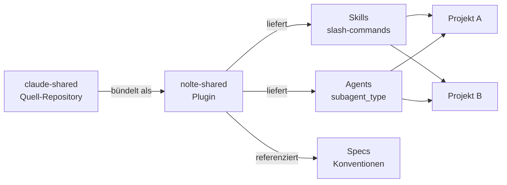

# Startseite

`claude-shared` ist eine gemeinsame Basis aus [Claude Code](https://docs.claude.com/en/docs/claude-code)-**Agents** und **Skills**, die über mehrere Projekte hinweg wiederverwendet wird. Paketiert als Plugin **`nolte-shared`**, damit Teams überall dieselben Review-Gewohnheiten, Coding-Richtlinien und Helfer-Workflows nutzen — ohne sie in jedem Repository neu zu bauen.

**Auslieferungsweg: vom Quell-Repository zu den konsumierenden Projekten**

Wie gelangt das `nolte-shared`-Plugin aus diesem Repository in die Projekte, die es nutzen?

<!-- diagram-source: user-described — claude-shared als nolte-shared-Plugin verpackt, das Skills/Agents/Specs an konsumierende Projekte ausliefert -->

| Aspekt | Details |
|--------|---------|
| **Repository** | [nolte/claude-shared](https://github.com/nolte/claude-shared) |
| **Plugin-Name** | `nolte-shared` |
| **Slash-Namespace** | `/nolte-shared:<skill>` |
| **Quellbaum Skills** | `skills/<name>/` |
| **Quellbaum Agents** | `agents/<name>.md` |
| **Spezifikationen** | `spec/claude/<topic>/<lang>.md` |
| **Status** | Aktive Entwicklung; Schnittstellen können sich ändern |

## Was ist enthalten

- :jigsaw: **Skills** — wiederverwendbare Slash-Commands und Workflows, aufgerufen über das `Skill`-Tool
- :robot: **Agents** — spezialisierte Sub-Agents mit fokussiertem Tool-Zugriff und System-Prompt
- :scroll: **Spezifikationen** — strukturelle Regeln für Skills und Agents, mehrsprachig (DE/EN)
- :hammer_and_wrench: **Konventionen** — geteilte `CLAUDE.md`-Bausteine und Prompt-Fragmente

!!! info "Was dieses Repository *nicht* ist"
    Es ist keine End-User-App, kein Framework und kein Ersatz für Claude Code. Es ist eine **Sammlung geteilter Konfigurationen**, die in Claude Code eingesteckt werden.

## Weiter

Wenn du das Plugin in deinem eigenen Projekt **nutzen** willst, beginne bei [nolte-shared nutzen](using.md). Wenn du an diesem Repository **entwickeln** willst, beginne bei [Erste Schritte](getting-started/index.md).

- [nolte-shared nutzen](using.md) — das Plugin downstream installieren und nutzen — _Zielgruppe:_ `downstream-user`
- [Erste Schritte](getting-started/index.md) — Plugin laden und eigene Skills nutzen — _Zielgruppe:_ `downstream-user`, `dogfooding-author`
- [Skills](skills/index.md) — Überblick der mitgelieferten Skills — _Zielgruppe:_ `downstream-user`, `maintainer`
- [Agents](agents/index.md) — Überblick der mitgelieferten Agents — _Zielgruppe:_ `downstream-user`, `maintainer`
- [Spezifikationen](references/specs/index.md) — verbindliche Regeln für Autoren — _Zielgruppe:_ `maintainer`, `external-contributor`
- [Entwicklung](guides/development.md) — am Repository selbst arbeiten — _Zielgruppe:_ `external-contributor`, `maintainer`
