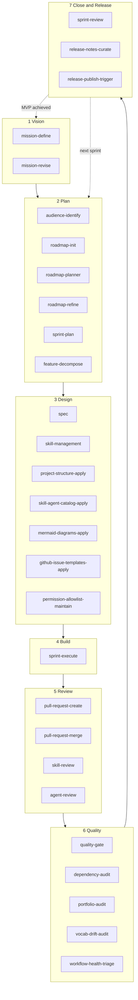

# Entwicklungszyklus

Die `nolte-shared`-Skills decken den vollständigen Entwicklungszyklus eines Projekts ab — vom ersten Mission-Statement bis zum veröffentlichten Release-Artefakt. Diese Seite zeigt, wo jeder Skill greift.

Der Zyklus hat sieben Phasen. Das Diagramm ist **zyklisch**: am Ende eines Sprints kehrt der Lauf zurück zu **Plan**, um den nächsten Sprint zu planen; sobald das MVP erreicht ist, kehrt der Lauf zurück zu **Vision**, damit die Mission Richtung Stabilisierung revidiert werden kann.

<!-- diagram-source: user-described — seven-phase lifecycle with skills grouped per phase, return edges from Close to Plan (next sprint) and from Close to Vision (MVP achieved) -->

## Phasen

### 1 Vision

Die Mission rahmt das gesamte Vorhaben ein: wem das Projekt dient, was als Erfolg gilt, wann das messbar ist. Diese Phase wird einmal beim Projektstart durchlaufen und bei MVP-Status-Übergängen erneut aufgesucht.

| Skill | Wann einsetzen |
|---|---|
| [`mission-define`](skills/nolte-shared/mission-define.md) | Erste `project/mission.md` schreiben, sobald Audience-Artefakt und `project/goals.md` vorliegen. |
| [`mission-revise`](skills/nolte-shared/mission-revise.md) | SMART-Statement anpassen, `mvp_status` entlang seines erlaubten Lebenszyklus umstellen oder nach Stabilisierung revidieren. |

### 2 Plan

Plan überführt die Outcomes der Mission in konkrete, einem Sprint zugeordnete Arbeit. Roadmap-Einträge zerfallen in Features, Features speisen Sprints.

| Skill | Wann einsetzen |
|---|---|
| [`audience-identify`](skills/nolte-shared/audience-identify.md) | Audience-Liste des bounded context aufstellen, bevor nachgelagerte Artefakte sie referenzieren. Vorbedingung für `mission-define` und `roadmap-init`. |
| [`roadmap-init`](skills/nolte-shared/roadmap-init.md) | `project/goals.md` und `project/roadmap.md` beim ersten Mal scaffolden. |
| [`roadmap-planner`](skills/nolte-shared/roadmap-planner.md) | Roadmap-Einträge hinzufügen, retargeten oder umformen; MVP-Flag entlang der asymmetrischen Regel umlegen. |
| [`roadmap-refine`](skills/nolte-shared/roadmap-refine.md) | Einträge auf Detailstufe `fine` heben, bevor sie in den aktuellen oder nächsten Sprint laufen. |
| [`sprint-plan`](skills/nolte-shared/sprint-plan.md) | Nächste Sprint-Datei unter `project/sprints/<NNNN>-<slug>.md` anlegen und passende Roadmap-Einträge einziehen. |
| [`feature-decompose`](skills/nolte-shared/feature-decompose.md) | Einen Roadmap-Eintrag in ein oder mehrere `project/features/<slug>.md`-Dateien zerlegen. |

### 3 Design

Design ist die Phase, in der Konventionen, Scaffolds und Spezifikationen geschrieben werden. Specs sind die autoritative Quelle für jeden nachgelagerten Skill, Agent und Beitrag.

| Skill | Wann einsetzen |
|---|---|
| [`spec`](skills/nolte-shared/spec.md) | Multilinguale Spezifikation unter `spec/` schreiben, übersetzen, deduplizieren oder Drift prüfen. |
| [`skill-management`](skills/nolte-shared/skill-management.md) | Einen Claude-Code-Skill im Plugin-Source-Tree schreiben oder überarbeiten. |
| [`project-structure-apply`](skills/nolte-shared/project-structure-apply.md) | `.github/`, Taskfile, MkDocs, Renovate-Config und Probot-Integrationen auditieren und scaffolden. |
| [`skill-agent-catalog-apply`](skills/nolte-shared/skill-agent-catalog-apply.md) | MkDocs-Skill-und-Agent-Katalog verdrahten, damit Docs jedes Artefakt sichtbar machen. |
| [`mermaid-diagrams-apply`](skills/nolte-shared/mermaid-diagrams-apply.md) | Mermaid-Diagramme-Konvention auf einer Doc-Seite anwenden. |
| [`github-issue-templates-apply`](skills/nolte-shared/github-issue-templates-apply.md) | `.github/ISSUE_TEMPLATE/`-Issue-Forms für die Audience des Projekts scaffolden oder aktualisieren. |
| [`permission-allowlist-maintain`](skills/nolte-shared/permission-allowlist-maintain.md) | Die committete `.claude/settings.json`-`permissions.allow`-Liste pflegen. |

### 4 Build

Ein geplanter Sprint wird aktiv, sobald das erste Feature startet. `sprint-execute` ist der Daily-Driver: er steuert den Feature-Status und hält die Frontmatter der Sprint-Datei mit der Realität synchron.

| Skill | Wann einsetzen |
|---|---|
| [`sprint-execute`](skills/nolte-shared/sprint-execute.md) | Sprint auf `active` setzen, Features durch `ready → in_progress → done` führen und `last_commit` pro Abschluss aktualisieren. |

### 5 Review

Code-Änderung erreicht `develop` ausschließlich über einen geprüften Pull Request. Skill- und Agent-Artefakte haben dedizierte Review-Skills mit persistenten Review-Plänen unter `.audits/`.

| Skill | Wann einsetzen |
|---|---|
| [`pull-request-create`](skills/nolte-shared/pull-request-create.md) | Draft-PR mit Conventional-Commits-Titel und Fünf-Sektionen-Body anlegen. Führt `task lint` lokal vor dem Push aus. |
| [`pull-request-merge`](skills/nolte-shared/pull-request-merge.md) | Draft auf ready setzen, Labels anwenden, Automerge triggern und prüfen, dass der Merge-Commit auf `develop` gelandet ist. |
| [`skill-review`](skills/nolte-shared/skill-review.md) | Einen Skill gegen `skill-management` / `skill-vs-agent` auditieren; persistenten Review-Plan emittieren. |
| [`agent-review`](skills/nolte-shared/agent-review.md) | Gleiche Form wie `skill-review`, aber für Agents. |

### 6 Quality

Quality-Skills laufen vorrangig in CI- und Pre-Push-Kontexten, einige werden auch ad-hoc gerufen, wenn ein Audit fällig ist. `quality-gate` wird typischerweise aus `pull-request-create` vor dem Push aufgerufen.

| Skill | Wann einsetzen |
|---|---|
| [`quality-gate`](skills/nolte-shared/quality-gate.md) | Lint, Typecheck und Test parallel vor Commit, PR oder Release ausführen. |
| [`dependency-audit`](skills/nolte-shared/dependency-audit.md) | Dependency-Tree auf CVEs scannen, optional Lizenz-Issues; Pre-PR- oder Pre-Release-Gate. |
| [`portfolio-audit`](skills/nolte-shared/portfolio-audit.md) | Cross-Repository-Capability-Portfolio auf Duplikate und Lücken prüfen. |
| [`vocab-drift-audit`](skills/nolte-shared/vocab-drift-audit.md) | Lokales Vale-Vokabular gegen das gepinnte `nolte/vale-style`-Release diffen. |
| [`workflow-health-triage`](skills/nolte-shared/workflow-health-triage.md) | Einen failing-required-Workflow auf `develop` oder `main` triagen und in die passende Fix-Lane dispatchen. |

### 7 Close and Release

Ein Sprint wird geschlossen, indem sein deployment-fähiges Artefakt validiert wird; Release-Skills ergänzen und publishen die Release-Notes, die release-drafter angesammelt hat.

| Skill | Wann einsetzen |
|---|---|
| [`sprint-review`](skills/nolte-shared/sprint-review.md) | `artifact_ref` validieren, das wertverifizierende Akzeptanzkriterium bestätigen, optional in Release-Skills überleiten und den Sprint schließen. |
| [`release-notes-curate`](skills/nolte-shared/release-notes-curate.md) | Offenen release-drafter-Draft auf `develop` mit projekt-kontext-aware-Sektionen anreichern. |
| [`release-publish-trigger`](skills/nolte-shared/release-publish-trigger.md) | Jedes Pre-Publish-Gate lokal validieren, dann `release-publish.yml` für den Draft dispatchen. |

## Rück-Kanten im Zyklus

- **Close → Plan (nächster Sprint).** Wenn ein Sprint schließt, wird der nächste Sprint geplant (`sprint-plan`) und die Roadmap verfeinert (`roadmap-refine`) für Einträge, deren `target_sprint` jetzt auf den anstehenden Sprint zeigt.
- **Close → Vision (MVP erreicht).** Sobald das wertverifizierende Feature-Kriterium greift und der `mvp_status` der Mission bereit für den nächsten Schritt ist, schaltet `mission-revise` den Status entlang `defining → in_progress → achieved → stabilised` weiter.

## Nicht von dieser Seite abgedeckt

Diese Seite handelt vom Projekt-Lifecycle; Querschnittsthemen und Per-Artefakt-Reviews haben eigene Seiten:

- Der [Agent-Katalog](agents/index.md) listet jeden ausgelieferten Agent samt Zuständigkeit.
- Der [Skill-Katalog](skills/index.md) listet jeden ausgelieferten Skill in alphabetischer Reihenfolge, ohne die Lifecycle-Gruppierung.
