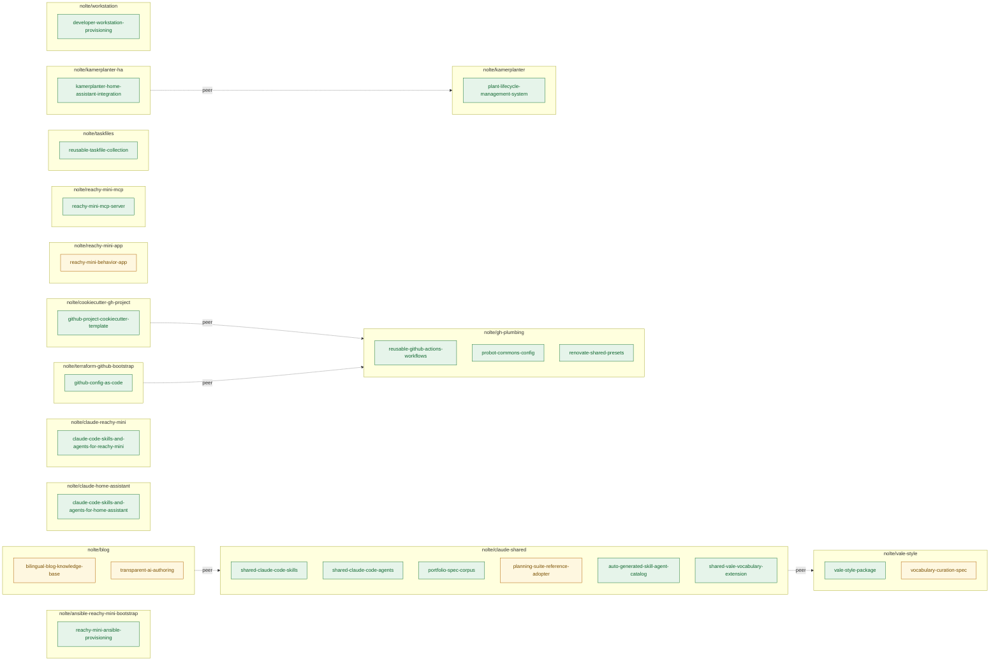

<!-- AUTO-GENERATED by scripts/docs/gen_portfolio.py from portfolio/aggregate.yml. Do not edit by hand; edit the snapshot and run `task docs:portfolio`. -->

# Portfolio-Inventar

Aggregiertes Fähigkeiten-Inventar über das aktive `nolte/*`-Portfolio, generiert aus dem `project/portfolio.yml`-Manifest jedes Member-Repositories. Diese Seite ist auto-generiert — bearbeite `portfolio/aggregate.yml` (oder lass die Render-Operation des `portfolio-audit`-Skills erneut laufen), nicht diese Datei.

**15** Repositories · **24** Fähigkeiten

## Fähigkeiten-Karte

Fähigkeit-zu-Repository-Zuordnung über das Portfolio.

<!-- diagram-source: derived—portfolio/aggregate.yml -->

Status: ✅ active · 🧪 experimental · ⚠️ deprecated · 🗓️ planned

## nolte/ansible-reachy-mini-bootstrap

> ansible-reachy-mini-bootstrap provisions a Reachy Mini WiFi device to a working Pollen/Reachy runtime state from a single inventory plus playbook run, so any owner reaches an identical, reproducible device state without manual per-device setup.

### Fähigkeiten

| Fähigkeit | Status | Beschreibung | Zielgruppen |
|---|---|---|---|
| `reachy-mini-ansible-provisioning` | ✅ active | An Ansible playbook and role collection that bootstraps a Reachy Mini WiFi device (Raspberry Pi OS) to a working state — network, system dependencies, and the Pollen/Reachy runtime — from a single inventory plus playbook run. | `nolte` (repo author, first operator on his own device) Reachy Mini owner / hobbyist |

### Peer-Referenzen

_Keine deklariert._

## nolte/blog

> A bilingual AI-drafted and human-curated knowledge base that turns the author's software-project work into durable English and German posts for technical readers, portfolio reviewers, and the author's own future-self.

### Fähigkeiten

| Fähigkeit | Status | Beschreibung | Zielgruppen |
|---|---|---|---|
| `bilingual-blog-knowledge-base` | 🧪 experimental | A bilingual (English-canonical, German-translated) Astro blog and personal knowledge base, deployed to GitHub Pages, that publishes durable posts as real EN+DE pairs without translation drift for technical readers, portfolio reviewers, and the author's own future-self. | A — Technical readers B — Portfolio reviewers C — Author as knowledge-base user |
| `transparent-ai-authoring` | 🧪 experimental | Per-post AI-disclosure (the aiGenerated frontmatter flag, with a planned visible badge and About-page explanation) that keeps AI-drafted content transparently distinct from hand-curated content. | A — Technical readers B — Portfolio reviewers L — People and projects named in posts |

### Peer-Referenzen

- `nolte/claude-shared`

## nolte/claude-home-assistant

> claude-home-assistant gives the plugin author and later public users a Claude Code skill and agent set that authors Home Assistant artefacts (custom integrations, Lovelace cards, blueprints, automations, ESPHome work) against Home Assistant Core and HACS conventions.

### Fähigkeiten

| Fähigkeit | Status | Beschreibung | Zielgruppen |
|---|---|---|---|
| `claude-code-skills-and-agents-for-home-assistant` | ✅ active | A Claude Code plugin bundling skills and agents for Home Assistant development — custom integrations, Lovelace cards, blueprints and automations, and ESPHome / add-on work — that authors HA artefacts against Home Assistant Core and HACS conventions. | Plugin-Autor beim Dogfooding in diesem Repo (nolte) Spätere öffentliche Nutzer (HA-Custom-Integration- und Card-Autoren-Community) |

### Peer-Referenzen

_Keine deklariert._

## nolte/claude-reachy-mini

> claude-reachy-mini gives the plugin author and later public users a Claude Code skill and agent set that builds Reachy Mini apps (dance- to-music behaviours and Home Assistant integration) with consistent, spec-grounded tooling.

### Fähigkeiten

| Fähigkeit | Status | Beschreibung | Zielgruppen |
|---|---|---|---|
| `claude-code-skills-and-agents-for-reachy-mini` | ✅ active | A Claude Code plugin bundling skills and agents for Reachy Mini robot development — dance-to-music behaviours and Home Assistant integration — so the operator builds Reachy Mini apps with consistent, spec-grounded tooling. | Plugin-Autor beim Dogfooding in diesem Repo (nolte) Spätere öffentliche Nutzer (Reachy-Mini-Hobby- und Maker-Community) |

### Peer-Referenzen

_Keine deklariert._

## nolte/claude-shared

> claude-shared (the nolte-shared Claude Code plugin) gives downstream Claude Code users in nolte portfolio projects plus the plugin's own dogfooding maintainer a consistent, spec-compliant set of skills, agents, and bilingual specifications they can apply without per-repository reimplementation.

### Fähigkeiten

| Fähigkeit | Status | Beschreibung | Zielgruppen |
|---|---|---|---|
| `shared-claude-code-skills` | ✅ active | Bundles reusable Claude Code skills (slash commands) under skills/&lt;name&gt;/SKILL.md that downstream nolte portfolio projects install through the plugin marketplace to get consistent, spec-compliant authoring, review, planning, and release workflows. | Downstream Claude Code users in portfolio projects Plugin author dogfooding inside this repo |
| `shared-claude-code-agents` | ✅ active | Bundles reusable Claude Code sub-agents under agents/&lt;name&gt;.md (context-window-protective read-only or write-narrow specialists) that downstream projects invoke through Agent(subagent_type=&lt;plugin&gt;:&lt;agent&gt;). | Downstream Claude Code users in portfolio projects Plugin author dogfooding inside this repo |
| `portfolio-spec-corpus` | ✅ active | Bilingual (EN-canonical with DE translation) specs under spec/ that govern Claude Code skill and agent authoring, project layout, branching, releases, audience identification, and portfolio management for the nolte portfolio. | Plugin author dogfooding inside this repo Other Nolte portfolio repos as passive consumers of the conventions External contributors via pull request |
| `planning-suite-reference-adopter` | 🧪 experimental | Applies the planning-suite specs (mission, goals, roadmap, features, sprints) to claude-shared itself under project/, so other Portfolio-Member repos see the planning suite in action before adopting it. | Plugin author dogfooding inside this repo Downstream Claude Code users in portfolio projects |
| `auto-generated-skill-agent-catalog` | ✅ active | Generates a navigable MkDocs catalog of every skill and agent in the nolte-shared plugin (and optionally external plugin source roots) so downstream readers discover what the plugin ships without reading the source tree directly. | Downstream Claude Code users in portfolio projects Plugin author dogfooding inside this repo External contributors via pull request |
| `shared-vale-vocabulary-extension` | ✅ active | Extends the nolte/vale-style baseline vocabulary with portfolio-specific terms (autoload, autolink, Probot, Renovate, vtracer, retarget, and similar) so prose under README.md, docs/en/, and spec/**/en.md passes Vale across the portfolio. | Plugin author dogfooding inside this repo Other Nolte portfolio repos as passive consumers of the conventions |

### Peer-Referenzen

- `nolte/vale-style`

## nolte/cookiecutter-gh-project

> Cookiecutter-gh-project scaffolds a standardised nolte-style GitHub project, pre-wired with gh-plumbing-based GitHub Actions, settings, and mkdocs documentation, from a single cookiecutter run, so a developer starts a new repository from one consistent baseline.

### Fähigkeiten

| Fähigkeit | Status | Beschreibung | Zielgruppen |
|---|---|---|---|
| `github-project-cookiecutter-template` | ✅ active | A Cookiecutter template that scaffolds a standardised nolte-style GitHub project — pre-wired GitHub Actions and settings based on nolte/gh-plumbing (release process, MkDocs docs publishing, static tests, labelling) — from a single cookiecutter run. | Developer scaffolding a new nolte-style GitHub project |

### Peer-Referenzen

- `nolte/gh-plumbing`

## nolte/gh-plumbing

> gh-plumbing gives downstream nolte/* repositories one centralised, tag-pinned source of reusable GitHub Actions workflows, Probot governance commons, and Renovate presets, so they achieve consistent CI/CD and repository governance without duplicating or copy-pasting pipeline and configuration boilerplate.

### Fähigkeiten

| Fähigkeit | Status | Beschreibung | Zielgruppen |
|---|---|---|---|
| `reusable-github-actions-workflows` | ✅ active | A library of reusable GitHub Actions workflows (reusable-*.yaml: pre-commit, mkdocs deploy, spelling/Vale, automerge, release-drafter/publish, Docker lint/build/publish, Ansible molecule/galaxy, Terraform lint, Trivy, chain-bench, dependency-review) that downstream nolte/* repositories call to get consistent CI/CD without reimplementing pipelines. | Downstream repositories consuming reusable workflows Repository maintainer (nolte) |
| `probot-commons-config` | ✅ active | Shared Probot app configuration commons (settings, release-drafter, boring-cyborg, stale presets) that downstream nolte/* repositories extend so repository governance stays uniform across the portfolio. | Downstream repositories extending Probot configurations Repository maintainer (nolte) |
| `renovate-shared-presets` | ✅ active | Shared Renovate configuration presets (renovate-configs/) that downstream nolte/* repositories extend for consistent dependency-update grouping, scheduling, and labelling. | Downstream repositories consuming Renovate presets Renovate bot |

### Peer-Referenzen

_Keine deklariert._

## nolte/kamerplanter

> Kamerplanter begleitet Pflanzen-Besitzer, Selbst-Hoster und Mitwirkende in einem selbst-gehosteten, mandantenfähigen System von der Aussaat bis zur Nacherntebehandlung mit phasengenauen Pflege-, Dünge- und Umgebungsempfehlungen, datenschutzfreundlich und vollständig in eigener Hand betreibbar.

### Fähigkeiten

| Fähigkeit | Status | Beschreibung | Zielgruppen |
|---|---|---|---|
| `plant-lifecycle-management-system` | ✅ active | A self-hosted, multi-tenant plant lifecycle management system — seed-to-harvest tracking with a growth-phase state machine (GDD/VPD/photoperiod), nutrient planning, adaptive care reminders, integrated pest management, a RAG knowledge assistant, and a Home Assistant integration — for home growers, hobby gardeners, and community gardens. | Home grower / hobby gardener / houseplant owner Community-garden administrator Self-hoster |

### Peer-Referenzen

_Keine deklariert._

## nolte/kamerplanter-ha

> kamerplanter-ha connects a Kamerplanter instance to Home Assistant as a HACS-distributed integration, so Home Assistant users and self- hosters see plant monitoring, nutrient dosages, tank state, and per- location overviews as Home Assistant sensors and services.

### Fähigkeiten

| Fähigkeit | Status | Beschreibung | Zielgruppen |
|---|---|---|---|
| `kamerplanter-home-assistant-integration` | ✅ active | A HACS-distributed Home Assistant custom integration that connects a Kamerplanter instance to Home Assistant — exposing plant monitoring (growth phases, days-in-phase, next-phase predictions, nutrient-plan assignments), per-channel nutrient dosages, tank management, and per-location overviews as sensors and services. | Home Assistant user running Kamerplanter Self-hoster running both Kamerplanter and Home Assistant |

### Peer-Referenzen

- `nolte/kamerplanter`

## nolte/reachy-mini-app

_Kein Mission-Statement deklariert (`project/mission.md` fehlt)._

### Fähigkeiten

| Fähigkeit | Status | Beschreibung | Zielgruppen |
|---|---|---|---|
| `reachy-mini-behavior-app` | 🧪 experimental | A Reachy Mini behavior package built on the Pollen Robotics / Hugging Face reachy_mini SDK — packaging robot behaviours (for example dance-to-music) that run on the Reachy Mini and distributed as a Hugging Face app. | Reachy Mini owner / maker |

### Peer-Referenzen

_Keine deklariert._

## nolte/reachy-mini-mcp

> reachy-mini-mcp gives MCP clients and Reachy Mini owners one MCP server that exposes the Pollen Reachy Mini daemon over a stable tool interface, so any MCP-capable LLM frontend can read robot state and trigger motion without generating ad-hoc Python.

### Fähigkeiten

| Fähigkeit | Status | Beschreibung | Zielgruppen |
|---|---|---|---|
| `reachy-mini-mcp-server` | ✅ active | A Model Context Protocol server that wraps the Pollen Reachy Mini daemon behind a REST interface, exposing the robot's behaviours to MCP clients and LLM end users. | MCP clients Reachy Mini owners / developers |

### Peer-Referenzen

_Keine deklariert._

## nolte/taskfiles

> Taskfiles gives downstream nolte/* projects one centralised, remotely included collection of reusable Taskfile modules, so they get consistent task targets across local and CI runs without copying Taskfile logic into each repository.

### Fähigkeiten

| Fähigkeit | Status | Beschreibung | Zielgruppen |
|---|---|---|---|
| `reusable-taskfile-collection` | ✅ active | A collection of remotely-includable Taskfiles (src/taskfile-include-*.yaml for mkdocs, pre-commit, kind, and k8s) that downstream nolte/* projects include via the Task includes: mechanism to get consistent task targets without copying Taskfile logic into each repository. | Taskfile-consumer project Consumer-side developer running tasks locally Consumer-side CI/CD pipeline |

### Peer-Referenzen

_Keine deklariert._

## nolte/terraform-github-bootstrap

> terraform-github-bootstrap manages the nolte GitHub account's repository inventory and per-repo rulesets as reviewable Terraform code, so the account's configuration is reproducible and auditable instead of click-ops, complementing gh-plumbing's Probot-managed settings.

### Fähigkeiten

| Fähigkeit | Status | Beschreibung | Zielgruppen |
|---|---|---|---|
| `github-config-as-code` | ✅ active | Terraform (integrations/github provider) that manages the nolte GitHub account's repository inventory (existence, description, topics, visibility, feature flags) and per-repo repository rulesets (modern branch protection) as code — the deliberate complement to gh-plumbing's Probot-managed per-repo settings. | Terraform operator / maintainer (nolte) The nolte GitHub account and its repositories |

### Peer-Referenzen

- `nolte/gh-plumbing`

## nolte/vale-style

> vale-style ships a single curated Vale style package that consuming nolte/* repositories integrate via one .vale.ini entry to lint markdown consistently across the portfolio.

### Fähigkeiten

| Fähigkeit | Status | Beschreibung | Zielgruppen |
|---|---|---|---|
| `vale-style-package` | ✅ active | A curated Vale style package distributed as `nolte-styles.zip` via GitHub releases. Consumer repositories integrate it via a single `.vale.ini` `Packages` entry to lint markdown consistently across the portfolio. | nolte/* consumer repositories CI pipelines in consumer repos local developers in consumer repos |
| `vocabulary-curation-spec` | 🧪 experimental | A written specification under `spec/vocabulary-and-style-curation/{en,de}.md` that codifies inclusion criteria, removal policy, and group scoping for the vocabularies shipped in `vale-style-package`. Curator agents from `nolte/claude-shared` (`prose-vale-curator`, `vocab-drift-audit`) cite this spec to ground automated curation decisions. | nolte (primary maintainer) Claude Code agents / skills External contributors |

### Peer-Referenzen

_Keine deklariert._

## nolte/workstation

> nolte/workstation lets the workstation-operator bring any developer machine to an identical, reproducible state from a single chezmoi source tree, so every machine and the downstream tooling running on it behave the same.

### Fähigkeiten

| Fähigkeit | Status | Beschreibung | Zielgruppen |
|---|---|---|---|
| `developer-workstation-provisioning` | ✅ active | A chezmoi source tree that provisions a developer workstation to an identical, reproducible state from a single `chezmoi init --apply`: asdf-pinned CLI tool versions, a baseline git config, a curated zsh setup, the reusable Taskfile collection, and the pre-commit / cookiecutter / MkDocs Python virtualenvs. | workstation-operator downstream-tooling-consumers |

### Peer-Referenzen

_Keine deklariert._

## Historische Fähigkeiten

_Keine archivierten Repositories mit registrierten Fähigkeiten._
