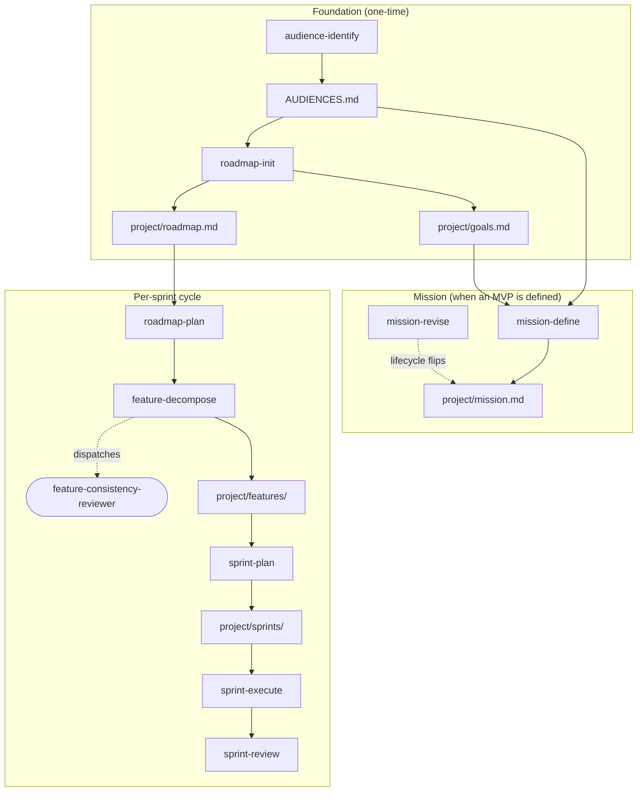

# Projekt

Dieser Abschnitt orientiert dich rund um den `project/`-Planungsbaum (Mission, Goals, Roadmap, Sprints, Features) und die Planning-Suite-Skills, die ihn operationalisieren.

Die Planning-Suite umfasst mehrere Skills sowie einen Agenten. Damit operationalisiert ein adoptierendes Repository die Specs `mission`, `roadmap`, `sprint`, `feature` und `release-artifact`. Diese Seite zeigt die typische Reihenfolge der Skill-Aufrufe und ordnet jedem Skill das Artefakt zu, das er schreibt.

Adoption ist freiwillig. Ein Repository ohne `project/`-Verzeichnis bleibt von jedem dieser Skills unberührt.

### Lifecycle-Übersicht

In welcher Reihenfolge werden die Planning-Suite-Skills aufgerufen, und welches Artefakt schreibt jeder davon?

<!-- diagram-source: user-described — Planning suite skills mapped to their lifecycle stage plus the artefact each writes -->

Stadium-Form (`feature-consistency-reviewer`) markiert den einzigen Agenten in der Suite; alle Rechtecke sind Skills oder On-disk-Artefakte. Gestrichelte Kanten markieren Dispatch- oder Lifecycle-Beziehungen, durchgezogene Kanten markieren Schreib-Operationen.

## Skill-zu-Stage-Karte

| Stage | Skill | Schreibt / liest | Governing Spec |
|---|---|---|---|
| Foundation | `audience-identify` | schreibt das Audience-Artefakt (typischerweise `AUDIENCES.md`) | `audience-identification` |
| Foundation | `roadmap-init` | schreibt `project/roadmap.md` und `project/goals.md` | `roadmap` |
| Mission | `mission-define` | schreibt erstmals `project/mission.md`, setzt `mvp_status: defining` | `mission` |
| Mission | `mission-revise` | editiert `project/mission.md`, flippt `mvp_status` (mit Stabilisierungs-Gate) | `mission` |
| Per-sprint cycle | `roadmap-refine` | enforced Detail-Level-Invariante; emittiert Violations | `roadmap` |
| Per-sprint cycle | `roadmap-plan` | fügt Items hinzu, promoviert Detail, flippt `mvp` | `roadmap`, `mission` |
| Per-sprint cycle | `feature-decompose` | schreibt `project/features/<slug>.md`; dispatcht `feature-consistency-reviewer` | `feature` |
| Per-sprint cycle | `sprint-plan` | schreibt `project/sprints/<NNNN>-<slug>.md` mit `status: planned` | `sprint` |
| Per-sprint cycle | `sprint-execute` | promoviert `planned → active`, treibt Feature-Übergänge, schreibt `last_commit` | `sprint`, `feature` |
| Per-sprint cycle | `sprint-review` | promoviert `active → review → closed` mit Artefakt-Validation | `sprint`, `release-artifact` |

## Der Agent: `feature-consistency-reviewer`

Wird ausschließlich von `feature-decompose` aufgerufen, niemals direkt vom Operator. Read-only-Tools (`Read`, `Grep`, `Glob`, `Bash`); produziert eine strukturierte Findings-Liste, die der Eltern-Skill in das `consistency_check`-Frontmatter und die `## Consistency notes`-Section eines Features schreibt. Das `draft → ready`-Gate des Features bleibt zu, solange ein `overlap`- oder `duplication`-Finding ohne Resolution offen ist.

## Optionale Release-Chain am Sprint-Ende

`sprint-review` kann am Sprint-Abschluss optional in zwei bestehende Skills chainen — operator-opt-in, niemals automatisch:

- `release-notes-curate` — reichert den offenen `release-drafter`-Draft mit projekt-typ-spezifischen Sections an.
- `release-publish-trigger` — validiert die Pre-Publish-Gates und löst `release-publish.yml` per `gh workflow run` aus.

Die Chain-Entscheidung (chained oder skipped) **MUSS** wortgetreu in `## Review notes` festgehalten werden — egal in welche Richtung.

## Wann Adoption sich lohnt

Die Suite zahlt sich aus, sobald ein Hobby-Projekt mehr als ein paar Releases ausliefert. Dann entsteht der Bedarf, die Frage „warum bauen wir das eigentlich?" formell zu beantworten. Reine Bibliotheken oder Tools ohne klare User-Audience brauchen Audience-Identifikation und Mission-Statement nicht. Die Specs erlauben deren Abwesenheit ausdrücklich.

Eine Adoption beginnt typischerweise so:

1. `audience-identify` ausführen, das Artefakt committen.
2. `roadmap-init` ausführen, `goals.md` und `roadmap.md` befüllen.
3. Erst wenn ein klarer Mehrwert für eine konkrete Audience entsteht: `mission-define` anstoßen.
4. Pro Sprint dann nur die drei Sprint-Skills (`sprint-plan` → `sprint-execute` → `sprint-review`) plus `feature-decompose` bei Bedarf.

`roadmap-refine` und `roadmap-plan` werden punktuell aufgerufen, nicht in jedem Sprint.
