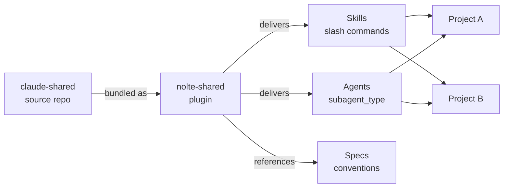

# claude-shared

`claude-shared` is a shared foundation of [Claude Code](https://docs.claude.com/en/docs/claude-code) **agents** and **skills**, intended to be reused across multiple projects. It's packaged as the **`nolte-shared`** plugin so teams get the same review habits, coding guidelines and helper workflows everywhere—without rebuilding them in every repository.

| Aspect | Details |
|--------|---------|
| **Repository** | [nolte/claude-shared](https://github.com/nolte/claude-shared) |
| **Plugin name** | `nolte-shared` |
| **Slash namespace** | `/nolte-shared:<skill>` |
| **Skills source** | `skills/<name>/` |
| **Agents source** | `agents/<name>.md` (planned) |
| **Specifications** | `spec/claude/<topic>/<lang>.md` |
| **Status** | Early stage—content being consolidated |

## What's included

- :jigsaw: **Skills**: reusable slash commands and workflows invoked via the `Skill` tool
- :robot: **Agents**: specialized sub-agents with focused tool access and system prompts
- :scroll: **Specifications**: structural rules for skills and agents, multilingual (DE/EN)
- :hammer_and_wrench: **Conventions**: shared `CLAUDE.md` snippets and prompt fragments

!!! info "What this repo is *not*"
    It isn't an end-user app, not a framework, and not a replacement for Claude Code. It's a **collection of shared configuration** that plugs into Claude Code.

## Next

- [Getting Started](getting-started/index.md): load the plugin and use the skills
- [Skills](skills/index.md): overview of bundled skills
- [Agents](agents/index.md): overview of planned and existing agents
- [Specifications](specs/index.md): authoring rules
- [Development](development/index.md): work on this repository
