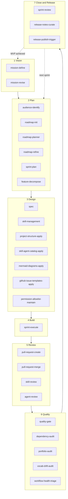

# Development lifecycle

The `nolte-shared` skills are designed to cover the full development lifecycle of a project, from first mission statement to released artefact. This page shows where each skill fits in.

The lifecycle has seven phases. The diagram is **cyclic**: at the end of a sprint, the loop returns to **Plan** to schedule the next sprint; when the MVP is achieved, the loop returns to **Vision** so the mission can be revised toward stabilisation.

<!-- diagram-source: user-described — seven-phase lifecycle with skills grouped per phase, return edges from Close to Plan (next sprint) and from Close to Vision (MVP achieved) -->

## Phases

### 1 Vision

The mission frames the entire effort: who the project serves, what counts as success, when success becomes measurable. This phase is entered once at project bootstrap and revisited at MVP-status transitions.

| Skill | When to invoke |
|---|---|
| [`mission-define`](skills/nolte-shared/mission-define.md) | Author the first `project/mission.md` once the audience artefact and `project/goals.md` exist. |
| [`mission-revise`](skills/nolte-shared/mission-revise.md) | Update the SMART statement, flip `mvp_status` along its legal lifecycle, or revise after stabilisation. |

### 2 Plan

Plan turns the mission's outcomes into concrete, sprint-targeted work. Roadmap items decompose into features, features feed sprints.

| Skill | When to invoke |
|---|---|
| [`audience-identify`](skills/nolte-shared/audience-identify.md) | Establish the bounded context's audience list before any downstream artefact references it. Precondition for `mission-define` and `roadmap-init`. |
| [`roadmap-init`](skills/nolte-shared/roadmap-init.md) | Scaffold `project/goals.md` and `project/roadmap.md` the first time. |
| [`roadmap-planner`](skills/nolte-shared/roadmap-planner.md) | Add, retarget, or reshape roadmap items; flip the MVP flag along the asymmetric rule. |
| [`roadmap-refine`](skills/nolte-shared/roadmap-refine.md) | Promote items to `fine` detail before they enter the next or current sprint. |
| [`sprint-plan`](skills/nolte-shared/sprint-plan.md) | Open the next sprint file at `project/sprints/<NNNN>-<slug>.md` and pull in matching roadmap items. |
| [`feature-decompose`](skills/nolte-shared/feature-decompose.md) | Decompose a roadmap item into one or more `project/features/<slug>.md` files. |

### 3 Design

Design is where conventions, scaffolds, and specifications are written. Specs are the authoritative source for every downstream skill, agent, and contribution.

| Skill | When to invoke |
|---|---|
| [`spec`](skills/nolte-shared/spec.md) | Author, translate, deduplicate, or drift-check a multilingual specification under `spec/`. |
| [`skill-management`](skills/nolte-shared/skill-management.md) | Author or revise a Claude Code skill in the plugin source tree. |
| [`project-structure-apply`](skills/nolte-shared/project-structure-apply.md) | Audit and scaffold the repository's `.github/`, Taskfile, MkDocs, Renovate config, and Probot integrations. |
| [`skill-agent-catalog-apply`](skills/nolte-shared/skill-agent-catalog-apply.md) | Wire up the MkDocs skill-and-agent catalog so docs surface every artefact. |
| [`mermaid-diagrams-apply`](skills/nolte-shared/mermaid-diagrams-apply.md) | Apply the Mermaid-diagrams convention to a doc page. |
| [`github-issue-templates-apply`](skills/nolte-shared/github-issue-templates-apply.md) | Scaffold or update `.github/ISSUE_TEMPLATE/` Issue Forms for the project's audience. |
| [`permission-allowlist-maintain`](skills/nolte-shared/permission-allowlist-maintain.md) | Curate the committed `.claude/settings.json` `permissions.allow` list. |

### 4 Build

A planned sprint becomes active when the first feature starts. Sprint-execute is the daily driver: it transitions feature state and keeps the sprint file's frontmatter in sync with reality.

| Skill | When to invoke |
|---|---|
| [`sprint-execute`](skills/nolte-shared/sprint-execute.md) | Promote the sprint to `active`, walk features through `ready → in_progress → done`, and update `last_commit` per completion. |

### 5 Review

Code change reaches `develop` only through a reviewed pull request. Skill and agent artefacts have their own dedicated review skills with persistent review plans under `.audits/`.

| Skill | When to invoke |
|---|---|
| [`pull-request-create`](skills/nolte-shared/pull-request-create.md) | Open a draft PR with a Conventional-Commits title and the five-section body. Runs `task lint` locally before push. |
| [`pull-request-merge`](skills/nolte-shared/pull-request-merge.md) | Promote the draft to ready, apply labels, trigger automerge, and verify the merge commit landed on `develop`. |
| [`skill-review`](skills/nolte-shared/skill-review.md) | Audit a skill against `skill-management` / `skill-vs-agent`; emit a persistent review plan. |
| [`agent-review`](skills/nolte-shared/agent-review.md) | Same shape as `skill-review`, but for agents. |

### 6 Quality

Quality skills run mostly in CI and pre-push contexts, but several are also invoked ad-hoc when an audit is due. `quality-gate` is typically called from `pull-request-create` before push.

| Skill | When to invoke |
|---|---|
| [`quality-gate`](skills/nolte-shared/quality-gate.md) | Run lint, typecheck, and test in parallel before commit, PR, or release. |
| [`dependency-audit`](skills/nolte-shared/dependency-audit.md) | Scan the dependency tree for CVEs, optionally license issues; pre-PR or pre-release gate. |
| [`portfolio-audit`](skills/nolte-shared/portfolio-audit.md) | Audit the cross-repository capability portfolio for duplicates and gaps. |
| [`vocab-drift-audit`](skills/nolte-shared/vocab-drift-audit.md) | Diff the local Vale vocabulary against the pinned `nolte/vale-style` release. |
| [`workflow-health-triage`](skills/nolte-shared/workflow-health-triage.md) | Triage a failing required workflow on `develop` or `main` and dispatch the appropriate fix lane. |

### 7 Close and Release

A sprint closes by validating its deployable artefact; release skills augment and publish the release notes that release-drafter has been accumulating.

| Skill | When to invoke |
|---|---|
| [`sprint-review`](skills/nolte-shared/sprint-review.md) | Validate `artifact_ref`, confirm the value-verifying acceptance criterion, optionally chain into release skills, then close the sprint. |
| [`release-notes-curate`](skills/nolte-shared/release-notes-curate.md) | Augment the open release-drafter draft on `develop` with project-context-aware sections. |
| [`release-publish-trigger`](skills/nolte-shared/release-publish-trigger.md) | Validate every pre-publish gate locally, then dispatch `release-publish.yml` for the draft. |

## Cycle return edges

- **Close → Plan (next sprint).** When a sprint closes, the next sprint is planned (`sprint-plan`) and the roadmap is refined (`roadmap-refine`) for items whose `target_sprint` now points at the upcoming sprint.
- **Close → Vision (MVP achieved).** When the verifying-feature criterion fires and the mission's `mvp_status` is ready to advance, `mission-revise` flips the status along `defining → in_progress → achieved → stabilised`.

## Not covered here

This page is about the project lifecycle; cross-cutting concerns and per-artefact reviews have their own pages:

- The [agent catalog](agents/index.md) lists every shipped agent and its responsibility.
- The [skill catalog](skills/index.md) lists every shipped skill in alphabetical order, without the lifecycle grouping.
