# Development lifecycle

The `nolte-shared` skills and agents are designed to cover the full development lifecycle of a project, from first mission statement to released artefact. This page shows where each artefact fits in.

The lifecycle has seven sequential phases plus an eighth, **Cross-cutting**, that collects artefacts whose responsibility is genuinely phase-agnostic. The first seven phases form a **cycle**: at the end of a sprint, the loop returns to **Plan** to schedule the next sprint. Once the project reaches its minimum viable product (MVP), the loop returns to **Vision** so the mission can be revised toward stabilisation.

Every skill and agent declares its phase in its frontmatter (`phase:`); the catalog generator groups the [Skills](skills/index.md) and [Agents](agents/index.md) catalog pages by that field, so this page and the catalog stay in lock-step.

```mermaid
graph TD
  subgraph V["1 Vision"]
    mdef[mission-define]
    mrev[mission-revise]
  end
  subgraph P["2 Plan"]
    aid[audience-identify]
    arev["audience-review (A)"]
    rinit[roadmap-init]
    rplan[roadmap-plan]
    rref[roadmap-refine]
    splan[sprint-plan]
    fdec[feature-decompose]
    fcr["feature-consistency-reviewer (A)"]
  end
  subgraph D["3 Design"]
    spec[spec]
    srr["spec-readiness-reviewer (A)"]
    skm[skill-management]
    cpd["claude-plugin-developer (A)"]
    psa[project-structure-apply]
    sac[skill-agent-catalog-apply]
    mks[mkdocs-structure-apply]
    mda[mermaid-diagrams-apply]
    git[github-issue-templates-apply]
    pal[permission-allowlist-maintain]
    ddr[docs-dry-refactor]
    dat[docs-audience-tracks-apply]
    rsa[readme-structure-apply]
    yjs[yaml-json-schema]
    ada["audience-doc-author (A)"]
  end
  subgraph B["4 Build"]
    sex[sprint-execute]
  end
  subgraph R["5 Review"]
    prc[pull-request-create]
    prm[pull-request-merge]
    skr[skill-review]
    agr[agent-review]
  end
  subgraph Q["6 Quality"]
    qg[quality-gate]
    da[dependency-audit]
    pa[portfolio-audit]
    vda[vocab-drift-audit]
    wht[workflow-health-triage]
    dfc["docs-freshness-checker (A)"]
    pvc["prose-vale-curator (A)"]
  end
  subgraph C["7 Close and Release"]
    srev[sprint-review]
    rnc[release-notes-curate]
    rpt[release-publish-trigger]
  end
  subgraph X["8 Cross-cutting"]
    cta["cookiecutter-template-author (A)"]
    pts["png-to-transparent-svg (A)"]
  end
  V --> P
  P --> D
  D --> B
  B --> R
  R --> Q
  Q --> C
  C -. next sprint .-> P
  C -. MVP achieved .-> V
```

<!-- diagram-source: user-described — eight-phase lifecycle with skills and agents grouped per phase; agents are marked with a parenthetical (A) suffix; return edges from Close to Plan (next sprint) and from Close to Vision (MVP achieved) -->

Items marked **(A)** are agents; every other item is a skill.

## Phases

### 1 Vision

The mission frames the entire effort: who the project serves, what counts as success, when success becomes measurable. This phase is entered once at project bootstrap and revisited at MVP-status transitions.

| Artefact | Type | When to invoke |
|---|---|---|
| [`mission-define`](skills/nolte-shared/mission-define.md) | skill | Author the first `project/mission.md` once the audience artefact and `project/goals.md` exist. |
| [`mission-revise`](skills/nolte-shared/mission-revise.md) | skill | Update the SMART statement, flip `mvp_status` along its legal lifecycle, or revise after stabilisation. |

### 2 Plan

Plan turns the mission's outcomes into concrete, sprint-targeted work. Roadmap items decompose into features, features feed sprints. Two agents support this phase: `audience-review` audits the audience artefact before it underwrites planning, and `feature-consistency-reviewer` is dispatched mid-flow by `feature-decompose`.

| Artefact | Type | When to invoke |
|---|---|---|
| [`audience-identify`](skills/nolte-shared/audience-identify.md) | skill | Establish the bounded context's audience list before any downstream artefact references it. Precondition for `mission-define` and `roadmap-init`. |
| [`audience-review`](agents/nolte-shared/audience-review.md) | agent | Audit an existing audience artefact for completeness before mission, roadmap, or release-notes work depends on it. |
| [`roadmap-init`](skills/nolte-shared/roadmap-init.md) | skill | Scaffold `project/goals.md` and `project/roadmap.md` the first time. |
| [`roadmap-plan`](skills/nolte-shared/roadmap-plan.md) | skill | Add, retarget, or reshape roadmap items; flip the MVP flag along the asymmetric rule. |
| [`roadmap-refine`](skills/nolte-shared/roadmap-refine.md) | skill | Promote items to `fine` detail before they enter the next or current sprint. |
| [`sprint-plan`](skills/nolte-shared/sprint-plan.md) | skill | Open the next sprint file at `project/sprints/<NNNN>-<slug>.md` and pull in matching roadmap items. |
| [`feature-decompose`](skills/nolte-shared/feature-decompose.md) | skill | Decompose a roadmap item into one or more `project/features/<slug>.md` files. |
| [`feature-consistency-reviewer`](agents/nolte-shared/feature-consistency-reviewer.md) | agent | Dispatched by `feature-decompose` to audit a draft feature against the feature corpus, source roots, and spec corpus before `draft → ready`. |

### 3 Design

Design is where conventions, scaffolds, and specifications are written. Specs are the authoritative source for every downstream skill, agent, and contribution. Three agents support this phase: `spec-readiness-reviewer` for spec gates, `claude-plugin-developer` for new plugin artefacts, and `audience-doc-author` for audience-driven documentation drafts.

| Artefact | Type | When to invoke |
|---|---|---|
| [`spec`](skills/nolte-shared/spec.md) | skill | Author, translate, deduplicate, or drift-check a multilingual specification under `spec/`. |
| [`spec-readiness-reviewer`](agents/nolte-shared/spec-readiness-reviewer.md) | agent | Audit a spec for contradictions, audience fit, and domain completeness before promotion. |
| [`skill-management`](skills/nolte-shared/skill-management.md) | skill | Author or revise a Claude Code skill in the plugin source tree. |
| [`claude-plugin-developer`](agents/nolte-shared/claude-plugin-developer.md) | agent | Draft a new plugin skill or agent in strict conformance with every spec under `spec/claude/`. |
| [`project-structure-apply`](skills/nolte-shared/project-structure-apply.md) | skill | Audit and scaffold the repository's `.github/`, Taskfile, MkDocs, Renovate config, and Probot integrations. |
| [`skill-agent-catalog-apply`](skills/nolte-shared/skill-agent-catalog-apply.md) | skill | Wire up the MkDocs skill-and-agent catalog so docs surface every artefact. |
| [`mkdocs-structure-apply`](skills/nolte-shared/mkdocs-structure-apply.md) | skill | Audit and scaffold the per-language MkDocs skeleton, plugin baseline, and frontmatter contract. |
| [`mermaid-diagrams-apply`](skills/nolte-shared/mermaid-diagrams-apply.md) | skill | Apply the Mermaid-diagrams convention to a doc page. |
| [`github-issue-templates-apply`](skills/nolte-shared/github-issue-templates-apply.md) | skill | Scaffold or update `.github/ISSUE_TEMPLATE/` Issue Forms for the project's audience. |
| [`permission-allowlist-maintain`](skills/nolte-shared/permission-allowlist-maintain.md) | skill | Curate the committed `.claude/settings.json` `permissions.allow` list. |
| [`docs-dry-refactor`](skills/nolte-shared/docs-dry-refactor.md) | skill | Detect duplicated MkDocs prose and extract it through `mkdocs-include-markdown-plugin`. |
| [`docs-audience-tracks-apply`](skills/nolte-shared/docs-audience-tracks-apply.md) | skill | Audit and scaffold the documentation-tracks layer: per-page `track:` frontmatter, required user-/developer-docs content blocks, audience-to-track mapping. |
| [`readme-structure-apply`](skills/nolte-shared/readme-structure-apply.md) | skill | Audit and scaffold `README.md` against the six-section structure, length budget, link rules. |
| [`yaml-json-schema`](skills/nolte-shared/yaml-json-schema.md) | skill | Author, audit, refactor, and meta-validate YAML-encoded JSON Schema 2020-12 documents. |
| [`audience-doc-author`](agents/nolte-shared/audience-doc-author.md) | agent | Draft or refine an audience-tailored documentation artefact (README, release notes, MkDocs pages) against an existing audience artefact. |

### 4 Build

A planned sprint becomes active when the first feature starts. Sprint-execute is the daily driver: it transitions feature state and keeps the sprint file's frontmatter in sync with reality.

| Artefact | Type | When to invoke |
|---|---|---|
| [`sprint-execute`](skills/nolte-shared/sprint-execute.md) | skill | Promote the sprint to `active`, walk features through `ready → in_progress → done`, and update `last_commit` per completion. |

### 5 Review

Code change reaches `develop` only through a reviewed pull request. Skill and agent artefacts have their own dedicated review skills with persistent review plans under `.audits/`.

| Artefact | Type | When to invoke |
|---|---|---|
| [`pull-request-create`](skills/nolte-shared/pull-request-create.md) | skill | Open a draft PR with a Conventional-Commits title and the five-section body. Runs `task lint` locally before push. |
| [`pull-request-merge`](skills/nolte-shared/pull-request-merge.md) | skill | Promote the draft to ready, apply labels, trigger automerge, and verify the merge commit landed on `develop`. |
| [`skill-review`](skills/nolte-shared/skill-review.md) | skill | Audit a skill against `skill-management` / `skill-vs-agent`; emit a persistent review plan. |
| [`agent-review`](skills/nolte-shared/agent-review.md) | skill | Same shape as `skill-review`, but for agents. |

### 6 Quality

Quality skills and agents run mostly in CI and pre-push contexts, but several are also invoked ad-hoc when an audit is due. `quality-gate` is typically called from `pull-request-create` before push. Two agents support this phase: `docs-freshness-checker` audits the docs for drift, and `prose-vale-curator` curates prose against the Vale style.

| Artefact | Type | When to invoke |
|---|---|---|
| [`quality-gate`](skills/nolte-shared/quality-gate.md) | skill | Run lint, typecheck, and test in parallel before commit, PR, or release. |
| [`dependency-audit`](skills/nolte-shared/dependency-audit.md) | skill | Scan the dependency tree for CVEs, optionally license issues; pre-PR or pre-release gate. |
| [`portfolio-audit`](skills/nolte-shared/portfolio-audit.md) | skill | Audit the cross-repository capability portfolio for duplicates and gaps. |
| [`vocab-drift-audit`](skills/nolte-shared/vocab-drift-audit.md) | skill | Diff the local Vale vocabulary against the pinned `nolte/vale-style` release. |
| [`workflow-health-triage`](skills/nolte-shared/workflow-health-triage.md) | skill | Triage a failing required workflow on `develop` or `main` and dispatch the appropriate fix lane. |
| [`docs-freshness-checker`](agents/nolte-shared/docs-freshness-checker.md) | agent | Audit MkDocs docs for parity, dead links, stale spec/src references, ADR hygiene, and Mermaid-derived drift. |
| [`prose-vale-curator`](agents/nolte-shared/prose-vale-curator.md) | agent | Curate prose so it passes Vale; in vocabulary-owning repos, extend `accept.txt` for legitimate technical identifiers. |

### 7 Close and Release

A sprint closes by validating its deployable artefact; release skills augment and publish the release notes that release-drafter has been accumulating.

| Artefact | Type | When to invoke |
|---|---|---|
| [`sprint-review`](skills/nolte-shared/sprint-review.md) | skill | Validate `artifact_ref`, confirm the value-verifying acceptance criterion, optionally chain into release skills, then close the sprint. |
| [`release-notes-curate`](skills/nolte-shared/release-notes-curate.md) | skill | Augment the open release-drafter draft on `develop` with project-context-aware sections. |
| [`release-publish-trigger`](skills/nolte-shared/release-publish-trigger.md) | skill | Validate every pre-publish gate locally, then dispatch `release-publish.yml` for the draft. |

### 8 Cross-cutting

Cross-cutting artefacts are phase-agnostic: they're invoked when the situation calls for them, regardless of which lifecycle phase the surrounding work is in. Both current cross-cutting artefacts are agents.

| Artefact | Type | When to invoke |
|---|---|---|
| [`cookiecutter-template-author`](agents/nolte-shared/cookiecutter-template-author.md) | agent | Scaffold or refactor a `cookiecutter` template that renders a nolte-spec-conformant project; harden hooks; set up `pytest-cookies` plus the CI matrix. |
| [`png-to-transparent-svg`](agents/nolte-shared/png-to-transparent-svg.md) | agent | Convert a PNG with baked-in checkerboard fake transparency into a clean SVG with real alpha transparency. |

## Cycle return edges

- **Close → Plan (next sprint).** When a sprint closes, the next sprint is planned (`sprint-plan`) and the roadmap is refined (`roadmap-refine`) for items whose `target_sprint` now points at the upcoming sprint.
- **Close → Vision (MVP achieved).** When the verifying-feature criterion fires and the mission's `mvp_status` is ready to advance, `mission-revise` flips the status along `defining → in_progress → achieved → stabilised`.

## Not covered here

This page is about the project lifecycle; cross-cutting concerns and per-artefact catalog views have their own pages:

- The [agent catalog](agents/index.md) lists every shipped agent, grouped by phase, with the full agent metadata.
- The [skill catalog](skills/index.md) lists every shipped skill, grouped by phase, with the full skill metadata.
- The [tag index](tags.md) cross-references skills and agents that declare the same tag.
