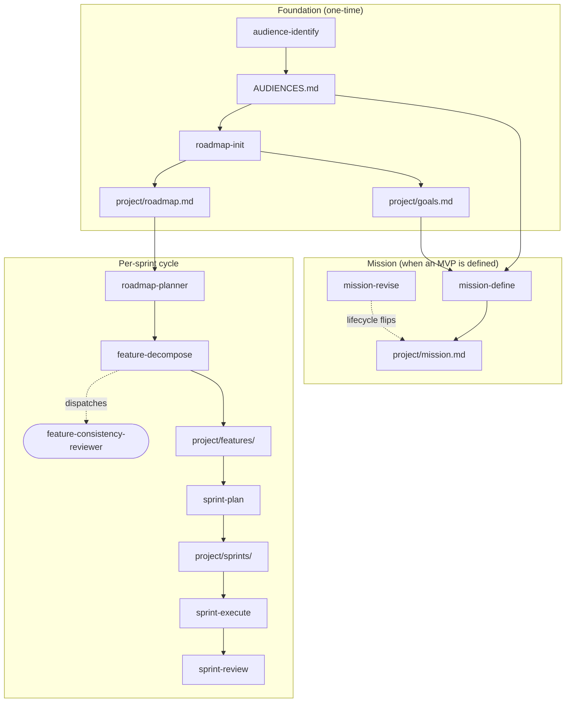

# Planning Suite

The planning suite is the collection of skills and one agent that operationalises the `mission`, `roadmap`, `sprint`, `feature`, and `release-artifact` specs in an adopting repository. This page bundles the order in which the skills are typically invoked, plus a map of which skill writes which artefact.

Adoption is voluntary—a repository without a `project/` directory isn't disturbed by any of these skills.

## Lifecycle overview

<!-- diagram-source: user-described — Planning suite skills mapped to their lifecycle stage plus the artefact each writes -->

The stadium shape (`feature-consistency-reviewer`) marks the only agent in the suite; every rectangle is a skill or an on-disk artefact. Dashed edges mark dispatch or lifecycle relationships; solid edges mark write operations.

## Skill-to-stage map

| Stage | Skill | Writes / reads | Governing spec |
|---|---|---|---|
| Foundation | `audience-identify` | writes the audience artefact (typically `AUDIENCES.md`) | `audience-identification` |
| Foundation | `roadmap-init` | writes `project/roadmap.md` and `project/goals.md` | `roadmap` |
| Mission | `mission-define` | first-writes `project/mission.md`, sets `mvp_status: defining` | `mission` |
| Mission | `mission-revise` | edits `project/mission.md`, flips `mvp_status` (with stabilisation gate) | `mission` |
| Per-sprint cycle | `roadmap-refine` | enforces the detail-level invariant; emits violations | `roadmap` |
| Per-sprint cycle | `roadmap-planner` | adds items, promotes detail, flips `mvp` | `roadmap`, `mission` |
| Per-sprint cycle | `feature-decompose` | writes `project/features/<slug>.md`; dispatches `feature-consistency-reviewer` | `feature` |
| Per-sprint cycle | `sprint-plan` | writes `project/sprints/<NNNN>-<slug>.md` with `status: planned` | `sprint` |
| Per-sprint cycle | `sprint-execute` | promotes `planned → active`, drives feature transitions, writes `last_commit` | `sprint`, `feature` |
| Per-sprint cycle | `sprint-review` | promotes `active → review → closed` with artefact validation | `sprint`, `release-artifact` |

## The agent: `feature-consistency-reviewer`

Invoked exclusively by `feature-decompose`, never directly by the operator. Read-only tools (`Read`, `Grep`, `Glob`, `Bash`); produces a structured findings list that the parent skill writes into the feature's `consistency_check` frontmatter and `## Consistency notes` section. The feature's `draft → ready` gate stays closed while any `overlap` or `duplication` finding remains unresolved.

## Optional release chain at sprint closure

At sprint closure, `sprint-review` may optionally chain into two existing skills (operator-opt-in, never automatic):

- `release-notes-curate`: augments the open `release-drafter` draft with project-type-specific sections.
- `release-publish-trigger`: validates the pre-publish gates and dispatches `release-publish.yml` via `gh workflow run`.

The chain decision (chained or skipped) **MUST** be recorded verbatim in `## Review notes` regardless of which way it falls.

## When adoption pays off

The suite earns its weight once a hobby project ships more than a handful of releases and the question of why the work is being done deserves a formal answer. A repository that's purely a library or a tool with no clearly identified user audience treats audience identification and the mission statement as overhead—the specs explicitly permit absence.

Adoption typically begins like this:

1. Run `audience-identify`, commit the artefact.
2. Run `roadmap-init`, populate `goals.md` and `roadmap.md`.
3. Only when a clear deliverable emerges for a concrete audience: invoke `mission-define`.
4. Per sprint thereafter, only the three sprint skills (`sprint-plan` → `sprint-execute` → `sprint-review`), plus `feature-decompose` as needed.

`roadmap-refine` and `roadmap-planner` are invoked on demand, not every sprint.
