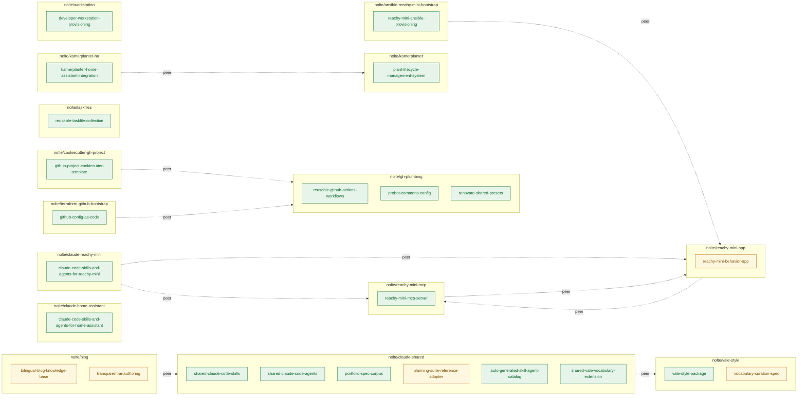
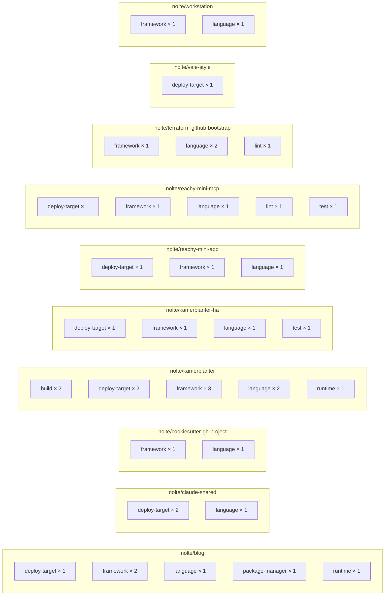

<!-- AUTO-GENERATED by scripts/docs/gen_portfolio.py from portfolio/aggregate.yml. Do not edit by hand; edit the snapshot and run `task docs:portfolio`. -->

# Portfolio inventory

Aggregated capability inventory across the active `nolte/*` portfolio, generated from each member repository's `project/portfolio.yml` manifest. This page is auto-generated — edit `portfolio/aggregate.yml` (or re-run the `portfolio-audit` skill's Render operation), not this file.

**15** repositories · **24** capabilities

## Capability map

Capability-to-repository mapping across the portfolio.

<!-- diagram-source: derived—portfolio/aggregate.yml -->

Status: ✅ active · 🧪 experimental · ⚠️ deprecated · 🗓️ planned

## Global tech stack

The portfolio-wide technical baseline, hand-curated in `portfolio/tech-stack.yml`. Every Portfolio-Member repository implicitly inherits each entry below whose status is `active` or `experimental`; a member opts out by declaring an override with a rationale. Sections follow the `group` order defined by the tech-stack spec, and entries are ordered by `kind` inside each group.

### Why this inventory exists

- **Visibility across repositories.** One page answers which repositories use which building block, instead of grepping the lockfiles and workflow files of every repository in turn (outcome O-1).
- **Compressed onboarding cost.** A new contributor reads the technical baseline in one place before opening a single source file (outcomes O-1, O-2).
- **Standardisation pressure with an explicit safety valve.** The portfolio carries a default stack, and a repository that deviates announces itself with a written rationale rather than quietly reinventing the setup (outcome O-1).
- **Auditability of structural outliers.** With the inventory in place the portfolio audit can ask structural questions a free-form README can't answer, such as which repository ships rendered documentation without declaring a documentation generator (outcomes O-2, O-3).
- **Dogfooding the planning suite.** `claude-shared` captures its own stack first, so the capture flow is proven here before it ships to consumers (outcome O-3).

Paraphrased from the tech-stack-discovery spec's Benefits section; the full wording and the outcome anchors live in [`spec/portfolio/tech-stack-discovery/`](https://github.com/nolte/claude-shared/blob/develop/spec/portfolio/tech-stack-discovery/en.md).

### `documentation`

| Entry | Kind | Status | Role |
|---|---|---|---|
| `mkdocs` | `docs` | ✅ active | Documentation generator producing the bilingual MkDocs site under docs/. |
| `markdownlint` | `lint` | ✅ active | Markdown style linter run via the pre-commit hook framework. |
| `vale` | `lint` | ✅ active | Prose linter using the pinned nolte/vale-style vocabularies and the Microsoft style ruleset. |

### `quality`

| Entry | Kind | Status | Role |
|---|---|---|---|
| `pre-commit` | `lint` | ✅ active | Pre-commit hook framework wiring trailing-whitespace, end-of-files, yamllint, markdownlint, and Vale checks. |

### `automation`

| Entry | Kind | Status | Role |
|---|---|---|---|
| `gh-plumbing` | `ci` | ✅ active | Portfolio CI/CD anchor providing reusable GitHub Actions workflows (mkdocs deploy, release-drafter, automerge, release-cd-refresh-master) consumed by every nolte/* repository. |
| `github-actions` | `ci` | ✅ active | Continuous-integration provider running lint, test, docs, release-drafter, and release-publish workflows. |
| `renovate` | `dep-bot` | ✅ active | Automated dependency-update bot extending the nolte/gh-plumbing common preset. |
| `boring-cyborg` | `other` | ✅ active | Probot GitHub App that auto-labels PRs by touched paths and welcomes first-time contributors per .github/boring-cyborg.yml. |
| `probot-settings` | `other` | ✅ active | Probot GitHub App that materialises .github/settings.yml (branch protection, labels, required checks) onto every nolte/* repository. |
| `release-drafter` | `other` | ✅ active | Release-notes drafter that aggregates merged PRs into a draft GitHub Release between version cuts, wired via a gh-plumbing reusable workflow. |
| `stale-bot` | `other` | ✅ active | Probot GitHub App that closes stale issues and PRs per .github/stale.yml. |

### `build-tooling`

| Entry | Kind | Status | Role |
|---|---|---|---|
| `task` | `build` | ✅ active | Task orchestrator running quality-gate, docs, plugin-reload, and lint targets via a portfolio-wide Taskfile convention. |

### `plugin-platform`

| Entry | Kind | Status | Role |
|---|---|---|---|
| `claude-code-plugin` | `framework` | ✅ active | Claude Code plugin shape defining the skills/&lt;name&gt;/SKILL.md and agents/&lt;name&gt;.md source layout plus the plugin/marketplace manifests. |
| `claude-code` | `runtime` | ✅ active | Host runtime that loads and executes skills and agents shipped by this plugin in contributor and end-user sessions. |

## Kind distribution

Repository-specific entries per `kind`, so structural outliers (a repository with two `language` entries, or none of a given kind) are visible at a glance. Inherited global entries are identical everywhere and are left out.

<!-- diagram-source: derived—portfolio/aggregate.yml -->

Origin: 🔗 inherited · ➕ repo-specific · 🚫 suppressed · 🔀 regrouped

## nolte/ansible-reachy-mini-bootstrap

> ansible-reachy-mini-bootstrap provisions a Reachy Mini WiFi device to a working Pollen/Reachy runtime state from a single inventory plus playbook run, so any owner reaches an identical, reproducible device state without manual per-device setup.

### Capabilities

| Capability | Status | Description | Audiences |
|---|---|---|---|
| `reachy-mini-ansible-provisioning` | ✅ active | An Ansible playbook and role collection that bootstraps a Reachy Mini WiFi device (Raspberry Pi OS) to a working state — network, system dependencies, and the Pollen/Reachy runtime — from a single inventory plus playbook run. | `nolte` (repo author, first operator on his own device) Reachy Mini owner / hobbyist |

### Tech stack

_No `tech_stack:` block declared yet; this repository's effective stack is the global baseline above, unchanged._

### Peer references

- `nolte/reachy-mini-app`

## nolte/blog

> A bilingual AI-drafted and human-curated knowledge base that turns the author's software-project work into durable English and German posts for technical readers, portfolio reviewers, and the author's own future-self.

### Capabilities

| Capability | Status | Description | Audiences |
|---|---|---|---|
| `bilingual-blog-knowledge-base` | 🧪 experimental | A bilingual (English-canonical, German-translated) Astro blog and personal knowledge base, deployed to GitHub Pages, that publishes durable posts as real EN+DE pairs without translation drift for technical readers, portfolio reviewers, and the author's own future-self. | A — Technical readers B — Portfolio reviewers C — Author as knowledge-base user |
| `transparent-ai-authoring` | 🧪 experimental | Per-post AI-disclosure (the aiGenerated frontmatter flag, with a planned visible badge and About-page explanation) that keeps AI-drafted content transparently distinct from hand-curated content. | A — Technical readers B — Portfolio reviewers L — People and projects named in posts |

### Tech stack

#### `documentation`

| Entry | Kind | Status | Origin | Notes |
|---|---|---|---|---|
| `mkdocs` | `docs` | ✅ active | 🚫 suppressed | Blog publishes its site and knowledge base with Astro, not MkDocs; this repo carries no docs/ MkDocs tree or mkdocs.yml. |
| `markdownlint` | `lint` | ✅ active | 🔗 inherited | — |
| `vale` | `lint` | ✅ active | 🔗 inherited | — |

#### `quality`

| Entry | Kind | Status | Origin | Notes |
|---|---|---|---|---|
| `pre-commit` | `lint` | ✅ active | 🔗 inherited | — |

#### `automation`

| Entry | Kind | Status | Origin | Notes |
|---|---|---|---|---|
| `gh-plumbing` | `ci` | ✅ active | 🔗 inherited | — |
| `github-actions` | `ci` | ✅ active | 🔗 inherited | — |
| `renovate` | `dep-bot` | ✅ active | 🔗 inherited | — |
| `github-pages` | `deploy-target` | ✅ active | ➕ repo-specific | — |
| `boring-cyborg` | `other` | ✅ active | 🔗 inherited | — |
| `probot-settings` | `other` | ✅ active | 🔗 inherited | — |
| `release-drafter` | `other` | ✅ active | 🔗 inherited | — |
| `stale-bot` | `other` | ✅ active | 🔗 inherited | — |

#### `build-tooling`

| Entry | Kind | Status | Origin | Notes |
|---|---|---|---|---|
| `task` | `build` | ✅ active | 🔗 inherited | — |
| `astro` | `framework` | ✅ active | ➕ repo-specific | — |
| `tailwindcss` | `framework` | ✅ active | ➕ repo-specific | — |
| `typescript` | `language` | ✅ active | ➕ repo-specific | — |
| `npm` | `package-manager` | ✅ active | ➕ repo-specific | — |
| `node` | `runtime` | ✅ active | ➕ repo-specific | — |

#### `plugin-platform`

| Entry | Kind | Status | Origin | Notes |
|---|---|---|---|---|
| `claude-code-plugin` | `framework` | ✅ active | 🚫 suppressed | Blog is an Astro web application, not a Claude Code plugin; it ships no skills/&lt;name&gt;/SKILL.md or agents/ layout, so the plugin-shape entry does not apply. |
| `claude-code` | `runtime` | ✅ active | 🔗 inherited | — |

#### Delta against the global stack

- 🚫 suppressed `mkdocs` — Blog publishes its site and knowledge base with Astro, not MkDocs; this repo carries no docs/ MkDocs tree or mkdocs.yml.
- 🚫 suppressed `claude-code-plugin` — Blog is an Astro web application, not a Claude Code plugin; it ships no skills/&lt;name&gt;/SKILL.md or agents/ layout, so the plugin-shape entry does not apply.
- ➕ repo-specific `node` — `runtime` / `build-tooling`
- ➕ repo-specific `npm` — `package-manager` / `build-tooling`
- ➕ repo-specific `astro` — `framework` / `build-tooling`
- ➕ repo-specific `typescript` — `language` / `build-tooling`
- ➕ repo-specific `tailwindcss` — `framework` / `build-tooling`
- ➕ repo-specific `github-pages` — `deploy-target` / `automation`

### Peer references

- `nolte/claude-shared`

## nolte/claude-home-assistant

> claude-home-assistant gives the plugin author and later public users a Claude Code skill and agent set that authors Home Assistant artefacts (custom integrations, Lovelace cards, blueprints, automations, ESPHome work) against Home Assistant Core and HACS conventions.

### Capabilities

| Capability | Status | Description | Audiences |
|---|---|---|---|
| `claude-code-skills-and-agents-for-home-assistant` | ✅ active | A Claude Code plugin bundling skills and agents for Home Assistant development — custom integrations, Lovelace cards, blueprints and automations, and ESPHome / add-on work — that authors HA artefacts against Home Assistant Core and HACS conventions. | Plugin-Autor beim Dogfooding in diesem Repo (nolte) Spätere öffentliche Nutzer (HA-Custom-Integration- und Card-Autoren-Community) |

### Tech stack

_No `tech_stack:` block declared yet; this repository's effective stack is the global baseline above, unchanged._

### Peer references

_None declared._

## nolte/claude-reachy-mini

> claude-reachy-mini gives the plugin author and later public users a Claude Code skill and agent set that builds Reachy Mini apps (dance- to-music behaviours and Home Assistant integration) with consistent, spec-grounded tooling.

### Capabilities

| Capability | Status | Description | Audiences |
|---|---|---|---|
| `claude-code-skills-and-agents-for-reachy-mini` | ✅ active | A Claude Code plugin bundling skills and agents for Reachy Mini robot development — dance-to-music behaviours and Home Assistant integration — so the operator builds Reachy Mini apps with consistent, spec-grounded tooling. | Plugin-Autor beim Dogfooding in diesem Repo (nolte) Spätere öffentliche Nutzer (Reachy-Mini-Hobby- und Maker-Community) |

### Tech stack

_No `tech_stack:` block declared yet; this repository's effective stack is the global baseline above, unchanged._

### Peer references

- `nolte/reachy-mini-app`
- `nolte/reachy-mini-mcp`

## nolte/claude-shared

> claude-shared (the nolte-shared Claude Code plugin) gives downstream Claude Code users in nolte portfolio projects plus the plugin's own dogfooding maintainer a consistent, spec-compliant set of skills, agents, and bilingual specifications they can apply without per-repository reimplementation.

### Capabilities

| Capability | Status | Description | Audiences |
|---|---|---|---|
| `shared-claude-code-skills` | ✅ active | Bundles reusable Claude Code skills (slash commands) under skills/&lt;name&gt;/SKILL.md that downstream nolte portfolio projects install through the plugin marketplace to get consistent, spec-compliant authoring, review, planning, and release workflows. | Downstream Claude Code users in portfolio projects Plugin author dogfooding inside this repo |
| `shared-claude-code-agents` | ✅ active | Bundles reusable Claude Code sub-agents under agents/&lt;name&gt;.md (context-window-protective read-only or write-narrow specialists) that downstream projects invoke through Agent(subagent_type=&lt;plugin&gt;:&lt;agent&gt;). | Downstream Claude Code users in portfolio projects Plugin author dogfooding inside this repo |
| `portfolio-spec-corpus` | ✅ active | Bilingual (EN-canonical with DE translation) specs under spec/ that govern Claude Code skill and agent authoring, project layout, branching, releases, audience identification, and portfolio management for the nolte portfolio. | Plugin author dogfooding inside this repo Other Nolte portfolio repos as passive consumers of the conventions External contributors via pull request |
| `planning-suite-reference-adopter` | 🧪 experimental | Applies the planning-suite specs (mission, goals, roadmap, features, sprints) to claude-shared itself under project/, so other Portfolio-Member repos see the planning suite in action before adopting it. | Plugin author dogfooding inside this repo Downstream Claude Code users in portfolio projects |
| `auto-generated-skill-agent-catalog` | ✅ active | Generates a navigable MkDocs catalog of every skill and agent in the nolte-shared plugin (and optionally external plugin source roots) so downstream readers discover what the plugin ships without reading the source tree directly. | Downstream Claude Code users in portfolio projects Plugin author dogfooding inside this repo External contributors via pull request |
| `shared-vale-vocabulary-extension` | ✅ active | Extends the nolte/vale-style baseline vocabulary with portfolio-specific terms (autoload, autolink, Probot, Renovate, vtracer, retarget, and similar) so prose under README.md, docs/en/, and spec/**/en.md passes Vale across the portfolio. | Plugin author dogfooding inside this repo Other Nolte portfolio repos as passive consumers of the conventions |

### Tech stack

#### `documentation`

| Entry | Kind | Status | Origin | Notes |
|---|---|---|---|---|
| `github-pages` | `deploy-target` | ✅ active | ➕ repo-specific | — |
| `mkdocs` | `docs` | ✅ active | 🔗 inherited | — |
| `python` | `language` | ✅ active | ➕ repo-specific | — |
| `markdownlint` | `lint` | ✅ active | 🔗 inherited | — |
| `vale` | `lint` | ✅ active | 🔗 inherited | — |

#### `quality`

| Entry | Kind | Status | Origin | Notes |
|---|---|---|---|---|
| `pre-commit` | `lint` | ✅ active | 🔗 inherited | — |

#### `automation`

| Entry | Kind | Status | Origin | Notes |
|---|---|---|---|---|
| `gh-plumbing` | `ci` | ✅ active | 🔗 inherited | — |
| `github-actions` | `ci` | ✅ active | 🔗 inherited | — |
| `renovate` | `dep-bot` | ✅ active | 🔗 inherited | — |
| `boring-cyborg` | `other` | ✅ active | 🔗 inherited | — |
| `probot-settings` | `other` | ✅ active | 🔗 inherited | — |
| `release-drafter` | `other` | ✅ active | 🔗 inherited | — |
| `stale-bot` | `other` | ✅ active | 🔗 inherited | — |

#### `build-tooling`

| Entry | Kind | Status | Origin | Notes |
|---|---|---|---|---|
| `task` | `build` | ✅ active | 🔗 inherited | — |

#### `plugin-platform`

| Entry | Kind | Status | Origin | Notes |
|---|---|---|---|---|
| `claude-code-marketplace` | `deploy-target` | ✅ active | ➕ repo-specific | — |
| `claude-code-plugin` | `framework` | ✅ active | 🔗 inherited | — |
| `claude-code` | `runtime` | ✅ active | 🔗 inherited | — |

#### Delta against the global stack

- ➕ repo-specific `python` — `language` / `documentation`
- ➕ repo-specific `github-pages` — `deploy-target` / `documentation`
- ➕ repo-specific `claude-code-marketplace` — `deploy-target` / `plugin-platform`

### Peer references

- `nolte/vale-style`

## nolte/cookiecutter-gh-project

> Cookiecutter-gh-project scaffolds a standardised nolte-style GitHub project, pre-wired with gh-plumbing-based GitHub Actions, settings, and mkdocs documentation, from a single cookiecutter run, so a developer starts a new repository from one consistent baseline.

### Capabilities

| Capability | Status | Description | Audiences |
|---|---|---|---|
| `github-project-cookiecutter-template` | ✅ active | A Cookiecutter template that scaffolds a standardised nolte-style GitHub project — pre-wired GitHub Actions and settings based on nolte/gh-plumbing (release process, MkDocs docs publishing, static tests, labelling) — from a single cookiecutter run. | Developer scaffolding a new nolte-style GitHub project |

### Tech stack

#### `documentation`

| Entry | Kind | Status | Origin | Notes |
|---|---|---|---|---|
| `mkdocs` | `docs` | ✅ active | 🔗 inherited | — |
| `markdownlint` | `lint` | ✅ active | 🔗 inherited | — |
| `vale` | `lint` | ✅ active | 🔗 inherited | — |

#### `quality`

| Entry | Kind | Status | Origin | Notes |
|---|---|---|---|---|
| `pre-commit` | `lint` | ✅ active | 🔗 inherited | — |

#### `automation`

| Entry | Kind | Status | Origin | Notes |
|---|---|---|---|---|
| `gh-plumbing` | `ci` | ✅ active | 🔗 inherited | — |
| `github-actions` | `ci` | ✅ active | 🔗 inherited | — |
| `renovate` | `dep-bot` | ✅ active | 🔗 inherited | — |
| `boring-cyborg` | `other` | ✅ active | 🔗 inherited | — |
| `probot-settings` | `other` | ✅ active | 🔗 inherited | — |
| `release-drafter` | `other` | ✅ active | 🔗 inherited | — |
| `stale-bot` | `other` | ✅ active | 🔗 inherited | — |

#### `build-tooling`

| Entry | Kind | Status | Origin | Notes |
|---|---|---|---|---|
| `task` | `build` | ✅ active | 🔗 inherited | — |
| `cookiecutter` | `framework` | ✅ active | ➕ repo-specific | — |
| `python` | `language` | ✅ active | ➕ repo-specific | — |

#### `plugin-platform`

| Entry | Kind | Status | Origin | Notes |
|---|---|---|---|---|
| `claude-code-plugin` | `framework` | ✅ active | 🔗 inherited | — |
| `claude-code` | `runtime` | ✅ active | 🔗 inherited | — |

#### Delta against the global stack

- ➕ repo-specific `python` — `language` / `build-tooling`
- ➕ repo-specific `cookiecutter` — `framework` / `build-tooling`

### Peer references

- `nolte/gh-plumbing`

## nolte/gh-plumbing

> gh-plumbing gives downstream nolte/* repositories one centralised, tag-pinned source of reusable GitHub Actions workflows, Probot governance commons, and Renovate presets, so they achieve consistent CI/CD and repository governance without duplicating or copy-pasting pipeline and configuration boilerplate.

### Capabilities

| Capability | Status | Description | Audiences |
|---|---|---|---|
| `reusable-github-actions-workflows` | ✅ active | A library of reusable GitHub Actions workflows (reusable-*.yaml: pre-commit, mkdocs deploy, spelling/Vale, automerge, release-drafter/publish, Docker lint/build/publish, Ansible molecule/galaxy, Terraform lint, Trivy, chain-bench, dependency-review) that downstream nolte/* repositories call to get consistent CI/CD without reimplementing pipelines. | Downstream repositories consuming reusable workflows Repository maintainer (nolte) |
| `probot-commons-config` | ✅ active | Shared Probot app configuration commons (settings, release-drafter, boring-cyborg, stale presets) that downstream nolte/* repositories extend so repository governance stays uniform across the portfolio. | Downstream repositories extending Probot configurations Repository maintainer (nolte) |
| `renovate-shared-presets` | ✅ active | Shared Renovate configuration presets (renovate-configs/) that downstream nolte/* repositories extend for consistent dependency-update grouping, scheduling, and labelling. | Downstream repositories consuming Renovate presets Renovate bot |

### Tech stack

_No `tech_stack:` block declared yet; this repository's effective stack is the global baseline above, unchanged._

### Peer references

_None declared._

## nolte/kamerplanter

> Kamerplanter begleitet Pflanzen-Besitzer, Selbst-Hoster und Mitwirkende in einem selbst-gehosteten, mandantenfähigen System von der Aussaat bis zur Nacherntebehandlung mit phasengenauen Pflege-, Dünge- und Umgebungsempfehlungen, datenschutzfreundlich und vollständig in eigener Hand betreibbar.

### Capabilities

| Capability | Status | Description | Audiences |
|---|---|---|---|
| `plant-lifecycle-management-system` | ✅ active | A self-hosted, multi-tenant plant lifecycle management system — seed-to-harvest tracking with a growth-phase state machine (GDD/VPD/photoperiod), nutrient planning, adaptive care reminders, integrated pest management, a RAG knowledge assistant, and a Home Assistant integration — for home growers, hobby gardeners, and community gardens. | Home grower / hobby gardener / houseplant owner Community-garden administrator Self-hoster |

### Tech stack

#### `documentation`

| Entry | Kind | Status | Origin | Notes |
|---|---|---|---|---|
| `mkdocs` | `docs` | ✅ active | 🔗 inherited | — |
| `markdownlint` | `lint` | ✅ active | 🔗 inherited | — |
| `vale` | `lint` | ✅ active | 🔗 inherited | — |

#### `quality`

| Entry | Kind | Status | Origin | Notes |
|---|---|---|---|---|
| `pre-commit` | `lint` | ✅ active | 🔗 inherited | — |

#### `automation`

| Entry | Kind | Status | Origin | Notes |
|---|---|---|---|---|
| `gh-plumbing` | `ci` | ✅ active | 🔗 inherited | — |
| `github-actions` | `ci` | ✅ active | 🔗 inherited | — |
| `renovate` | `dep-bot` | ✅ active | 🔗 inherited | — |
| `docker-image` | `deploy-target` | ✅ active | ➕ repo-specific | — |
| `kubernetes` | `deploy-target` | ✅ active | ➕ repo-specific | — |
| `boring-cyborg` | `other` | ✅ active | 🔗 inherited | — |
| `probot-settings` | `other` | ✅ active | 🔗 inherited | — |
| `release-drafter` | `other` | ✅ active | 🔗 inherited | — |
| `stale-bot` | `other` | ✅ active | 🔗 inherited | — |

#### `build-tooling`

| Entry | Kind | Status | Origin | Notes |
|---|---|---|---|---|
| `skaffold` | `build` | ✅ active | ➕ repo-specific | — |
| `task` | `build` | ✅ active | 🔗 inherited | — |
| `vite` | `build` | ✅ active | ➕ repo-specific | — |
| `celery` | `framework` | ✅ active | ➕ repo-specific | — |
| `fastapi` | `framework` | ✅ active | ➕ repo-specific | — |
| `react` | `framework` | ✅ active | ➕ repo-specific | — |
| `python` | `language` | ✅ active | ➕ repo-specific | — |
| `typescript` | `language` | ✅ active | ➕ repo-specific | — |
| `node` | `runtime` | ✅ active | ➕ repo-specific | — |

#### `plugin-platform`

| Entry | Kind | Status | Origin | Notes |
|---|---|---|---|---|
| `claude-code-plugin` | `framework` | ✅ active | 🔗 inherited | — |
| `claude-code` | `runtime` | ✅ active | 🔗 inherited | — |

#### Delta against the global stack

- ➕ repo-specific `python` — `language` / `build-tooling`
- ➕ repo-specific `fastapi` — `framework` / `build-tooling`
- ➕ repo-specific `celery` — `framework` / `build-tooling`
- ➕ repo-specific `node` — `runtime` / `build-tooling`
- ➕ repo-specific `react` — `framework` / `build-tooling`
- ➕ repo-specific `vite` — `build` / `build-tooling`
- ➕ repo-specific `typescript` — `language` / `build-tooling`
- ➕ repo-specific `docker-image` — `deploy-target` / `automation`
- ➕ repo-specific `kubernetes` — `deploy-target` / `automation`
- ➕ repo-specific `skaffold` — `build` / `build-tooling`

### Peer references

_None declared._

## nolte/kamerplanter-ha

> kamerplanter-ha connects a Kamerplanter instance to Home Assistant as a HACS-distributed integration, so Home Assistant users and self- hosters see plant monitoring, nutrient dosages, tank state, and per- location overviews as Home Assistant sensors and services.

### Capabilities

| Capability | Status | Description | Audiences |
|---|---|---|---|
| `kamerplanter-home-assistant-integration` | ✅ active | A HACS-distributed Home Assistant custom integration that connects a Kamerplanter instance to Home Assistant — exposing plant monitoring (growth phases, days-in-phase, next-phase predictions, nutrient-plan assignments), per-channel nutrient dosages, tank management, and per-location overviews as sensors and services. | Home Assistant user running Kamerplanter Self-hoster running both Kamerplanter and Home Assistant |

### Tech stack

#### `documentation`

| Entry | Kind | Status | Origin | Notes |
|---|---|---|---|---|
| `mkdocs` | `docs` | ✅ active | 🔗 inherited | — |
| `markdownlint` | `lint` | ✅ active | 🔗 inherited | — |
| `vale` | `lint` | ✅ active | 🔗 inherited | — |

#### `quality`

| Entry | Kind | Status | Origin | Notes |
|---|---|---|---|---|
| `pre-commit` | `lint` | ✅ active | 🔗 inherited | — |
| `pytest` | `test` | ✅ active | ➕ repo-specific | — |

#### `automation`

| Entry | Kind | Status | Origin | Notes |
|---|---|---|---|---|
| `gh-plumbing` | `ci` | ✅ active | 🔗 inherited | — |
| `github-actions` | `ci` | ✅ active | 🔗 inherited | — |
| `renovate` | `dep-bot` | ✅ active | 🔗 inherited | — |
| `hacs` | `deploy-target` | ✅ active | ➕ repo-specific | — |
| `boring-cyborg` | `other` | ✅ active | 🔗 inherited | — |
| `probot-settings` | `other` | ✅ active | 🔗 inherited | — |
| `release-drafter` | `other` | ✅ active | 🔗 inherited | — |
| `stale-bot` | `other` | ✅ active | 🔗 inherited | — |

#### `build-tooling`

| Entry | Kind | Status | Origin | Notes |
|---|---|---|---|---|
| `task` | `build` | ✅ active | 🔗 inherited | — |
| `home-assistant` | `framework` | ✅ active | ➕ repo-specific | — |
| `python` | `language` | ✅ active | ➕ repo-specific | — |

#### `plugin-platform`

| Entry | Kind | Status | Origin | Notes |
|---|---|---|---|---|
| `claude-code-plugin` | `framework` | ✅ active | 🔗 inherited | — |
| `claude-code` | `runtime` | ✅ active | 🔗 inherited | — |

#### Delta against the global stack

- ➕ repo-specific `python` — `language` / `build-tooling`
- ➕ repo-specific `home-assistant` — `framework` / `build-tooling`
- ➕ repo-specific `pytest` — `test` / `quality`
- ➕ repo-specific `hacs` — `deploy-target` / `automation`

### Peer references

- `nolte/kamerplanter`

## nolte/reachy-mini-app

> reachy-mini-app packages robot behaviours on the reachy_mini SDK and distributes them as a Hugging Face app, so Reachy Mini owners run behaviours like dance-to-music on their own device.

### Capabilities

| Capability | Status | Description | Audiences |
|---|---|---|---|
| `reachy-mini-behavior-app` | 🧪 experimental | A Reachy Mini behavior package built on the Pollen Robotics / Hugging Face reachy_mini SDK — packaging robot behaviours (for example dance-to-music) that run on the Reachy Mini and distributed as a Hugging Face app. | Reachy Mini owner / maker |

### Tech stack

#### `documentation`

| Entry | Kind | Status | Origin | Notes |
|---|---|---|---|---|
| `mkdocs` | `docs` | ✅ active | 🔗 inherited | — |
| `markdownlint` | `lint` | ✅ active | 🔗 inherited | — |
| `vale` | `lint` | ✅ active | 🔗 inherited | — |

#### `quality`

| Entry | Kind | Status | Origin | Notes |
|---|---|---|---|---|
| `pre-commit` | `lint` | ✅ active | 🔗 inherited | — |

#### `automation`

| Entry | Kind | Status | Origin | Notes |
|---|---|---|---|---|
| `gh-plumbing` | `ci` | ✅ active | 🔗 inherited | — |
| `github-actions` | `ci` | ✅ active | 🔗 inherited | — |
| `renovate` | `dep-bot` | ✅ active | 🔗 inherited | — |
| `huggingface-hub` | `deploy-target` | 🧪 experimental | ➕ repo-specific | — |
| `boring-cyborg` | `other` | ✅ active | 🔗 inherited | — |
| `probot-settings` | `other` | ✅ active | 🔗 inherited | — |
| `release-drafter` | `other` | ✅ active | 🔗 inherited | — |
| `stale-bot` | `other` | ✅ active | 🔗 inherited | — |

#### `build-tooling`

| Entry | Kind | Status | Origin | Notes |
|---|---|---|---|---|
| `task` | `build` | ✅ active | 🔗 inherited | — |
| `reachy-mini` | `framework` | ✅ active | ➕ repo-specific | — |
| `python` | `language` | ✅ active | ➕ repo-specific | — |

#### `plugin-platform`

| Entry | Kind | Status | Origin | Notes |
|---|---|---|---|---|
| `claude-code-plugin` | `framework` | ✅ active | 🔗 inherited | — |
| `claude-code` | `runtime` | ✅ active | 🔗 inherited | — |

#### Delta against the global stack

- ➕ repo-specific `python` — `language` / `build-tooling`
- ➕ repo-specific `reachy-mini` — `framework` / `build-tooling`
- ➕ repo-specific `huggingface-hub` — `deploy-target` / `automation`

### Peer references

- `nolte/reachy-mini-mcp`

## nolte/reachy-mini-mcp

> reachy-mini-mcp gives MCP clients and Reachy Mini owners one MCP server that exposes the Pollen Reachy Mini daemon over a stable tool interface, so any MCP-capable LLM frontend can read robot state and trigger motion without generating ad-hoc Python.

### Capabilities

| Capability | Status | Description | Audiences |
|---|---|---|---|
| `reachy-mini-mcp-server` | ✅ active | A Model Context Protocol server that wraps the Pollen Reachy Mini daemon behind a REST interface, exposing the robot's behaviours to MCP clients and LLM end users. | MCP clients Reachy Mini owners / developers |

### Tech stack

#### `documentation`

| Entry | Kind | Status | Origin | Notes |
|---|---|---|---|---|
| `mkdocs` | `docs` | ✅ active | 🔗 inherited | — |
| `markdownlint` | `lint` | ✅ active | 🔗 inherited | — |
| `vale` | `lint` | ✅ active | 🔗 inherited | — |

#### `quality`

| Entry | Kind | Status | Origin | Notes |
|---|---|---|---|---|
| `pre-commit` | `lint` | ✅ active | 🔗 inherited | — |
| `ruff` | `lint` | ✅ active | ➕ repo-specific | — |
| `pytest` | `test` | ✅ active | ➕ repo-specific | — |

#### `automation`

| Entry | Kind | Status | Origin | Notes |
|---|---|---|---|---|
| `gh-plumbing` | `ci` | ✅ active | 🔗 inherited | — |
| `github-actions` | `ci` | ✅ active | 🔗 inherited | — |
| `renovate` | `dep-bot` | ✅ active | 🔗 inherited | — |
| `docker-image` | `deploy-target` | ✅ active | ➕ repo-specific | — |
| `boring-cyborg` | `other` | ✅ active | 🔗 inherited | — |
| `probot-settings` | `other` | ✅ active | 🔗 inherited | — |
| `release-drafter` | `other` | ✅ active | 🔗 inherited | — |
| `stale-bot` | `other` | ✅ active | 🔗 inherited | — |

#### `build-tooling`

| Entry | Kind | Status | Origin | Notes |
|---|---|---|---|---|
| `task` | `build` | ✅ active | 🔗 inherited | — |
| `mcp` | `framework` | ✅ active | ➕ repo-specific | — |
| `python` | `language` | ✅ active | ➕ repo-specific | — |

#### `plugin-platform`

| Entry | Kind | Status | Origin | Notes |
|---|---|---|---|---|
| `claude-code-plugin` | `framework` | ✅ active | 🔗 inherited | — |
| `claude-code` | `runtime` | ✅ active | 🔗 inherited | — |

#### Delta against the global stack

- ➕ repo-specific `python` — `language` / `build-tooling`
- ➕ repo-specific `mcp` — `framework` / `build-tooling`
- ➕ repo-specific `ruff` — `lint` / `quality`
- ➕ repo-specific `pytest` — `test` / `quality`
- ➕ repo-specific `docker-image` — `deploy-target` / `automation`

### Peer references

- `nolte/reachy-mini-app`

## nolte/taskfiles

> Taskfiles gives downstream nolte/* projects one centralised, remotely included collection of reusable Taskfile modules, so they get consistent task targets across local and CI runs without copying Taskfile logic into each repository.

### Capabilities

| Capability | Status | Description | Audiences |
|---|---|---|---|
| `reusable-taskfile-collection` | ✅ active | A collection of remotely-includable Taskfiles (src/taskfile-include-*.yaml for mkdocs, pre-commit, kind, and k8s) that downstream nolte/* projects include via the Task includes: mechanism to get consistent task targets without copying Taskfile logic into each repository. | Taskfile-consumer project Consumer-side developer running tasks locally Consumer-side CI/CD pipeline |

### Tech stack

_No `tech_stack:` block declared yet; this repository's effective stack is the global baseline above, unchanged._

### Peer references

_None declared._

## nolte/terraform-github-bootstrap

> terraform-github-bootstrap manages the nolte GitHub account's repository inventory and per-repo rulesets as reviewable Terraform code, so the account's configuration is reproducible and auditable instead of click-ops, complementing gh-plumbing's Probot-managed settings.

### Capabilities

| Capability | Status | Description | Audiences |
|---|---|---|---|
| `github-config-as-code` | ✅ active | Terraform (integrations/github provider) that manages the nolte GitHub account's repository inventory (existence, description, topics, visibility, feature flags) and per-repo repository rulesets (modern branch protection) as code — the deliberate complement to gh-plumbing's Probot-managed per-repo settings. | Terraform operator / maintainer (nolte) The nolte GitHub account and its repositories |

### Tech stack

#### `documentation`

| Entry | Kind | Status | Origin | Notes |
|---|---|---|---|---|
| `mkdocs` | `docs` | ✅ active | 🔗 inherited | — |
| `markdownlint` | `lint` | ✅ active | 🔗 inherited | — |
| `vale` | `lint` | ✅ active | 🔗 inherited | — |

#### `quality`

| Entry | Kind | Status | Origin | Notes |
|---|---|---|---|---|
| `pre-commit` | `lint` | ✅ active | 🔗 inherited | — |
| `tflint` | `lint` | ✅ active | ➕ repo-specific | — |

#### `automation`

| Entry | Kind | Status | Origin | Notes |
|---|---|---|---|---|
| `gh-plumbing` | `ci` | ✅ active | 🔗 inherited | — |
| `github-actions` | `ci` | ✅ active | 🔗 inherited | — |
| `renovate` | `dep-bot` | ✅ active | 🔗 inherited | — |
| `boring-cyborg` | `other` | ✅ active | 🔗 inherited | — |
| `probot-settings` | `other` | ✅ active | 🔗 inherited | — |
| `release-drafter` | `other` | ✅ active | 🔗 inherited | — |
| `stale-bot` | `other` | ✅ active | 🔗 inherited | — |

#### `build-tooling`

| Entry | Kind | Status | Origin | Notes |
|---|---|---|---|---|
| `task` | `build` | ✅ active | 🔗 inherited | — |
| `terraform` | `framework` | ✅ active | ➕ repo-specific | — |
| `hcl` | `language` | ✅ active | ➕ repo-specific | — |
| `python` | `language` | ✅ active | ➕ repo-specific | — |

#### `plugin-platform`

| Entry | Kind | Status | Origin | Notes |
|---|---|---|---|---|
| `claude-code-plugin` | `framework` | ✅ active | 🔗 inherited | — |
| `claude-code` | `runtime` | ✅ active | 🔗 inherited | — |

#### Delta against the global stack

- ➕ repo-specific `terraform` — `framework` / `build-tooling`
- ➕ repo-specific `hcl` — `language` / `build-tooling`
- ➕ repo-specific `tflint` — `lint` / `quality`
- ➕ repo-specific `python` — `language` / `build-tooling`

### Peer references

- `nolte/gh-plumbing`

## nolte/vale-style

> vale-style ships a single curated Vale style package that consuming nolte/* repositories integrate via one .vale.ini entry to lint markdown consistently across the portfolio.

### Capabilities

| Capability | Status | Description | Audiences |
|---|---|---|---|
| `vale-style-package` | ✅ active | A curated Vale style package distributed as `nolte-styles.zip` via GitHub releases. Consumer repositories integrate it via a single `.vale.ini` `Packages` entry to lint markdown consistently across the portfolio. | nolte/* consumer repositories CI pipelines in consumer repos local developers in consumer repos |
| `vocabulary-curation-spec` | 🧪 experimental | A written specification under `spec/vocabulary-and-style-curation/{en,de}.md` that codifies inclusion criteria, removal policy, and group scoping for the vocabularies shipped in `vale-style-package`. Curator agents from `nolte/claude-shared` (`prose-vale-curator`, `vocab-drift-audit`) cite this spec to ground automated curation decisions. | nolte (primary maintainer) Claude Code agents / skills External contributors |

### Tech stack

#### `documentation`

| Entry | Kind | Status | Origin | Notes |
|---|---|---|---|---|
| `mkdocs` | `docs` | ✅ active | 🔗 inherited | — |
| `markdownlint` | `lint` | ✅ active | 🔗 inherited | — |
| `vale` | `lint` | ✅ active | 🔗 inherited | — |

#### `quality`

| Entry | Kind | Status | Origin | Notes |
|---|---|---|---|---|
| `pre-commit` | `lint` | ✅ active | 🔗 inherited | — |

#### `automation`

| Entry | Kind | Status | Origin | Notes |
|---|---|---|---|---|
| `gh-plumbing` | `ci` | ✅ active | 🔗 inherited | — |
| `github-actions` | `ci` | ✅ active | 🔗 inherited | — |
| `renovate` | `dep-bot` | ✅ active | 🔗 inherited | — |
| `github-releases` | `deploy-target` | ✅ active | ➕ repo-specific | — |
| `boring-cyborg` | `other` | ✅ active | 🔗 inherited | — |
| `probot-settings` | `other` | ✅ active | 🔗 inherited | — |
| `release-drafter` | `other` | ✅ active | 🔗 inherited | — |
| `stale-bot` | `other` | ✅ active | 🔗 inherited | — |

#### `build-tooling`

| Entry | Kind | Status | Origin | Notes |
|---|---|---|---|---|
| `task` | `build` | ✅ active | 🔗 inherited | — |

#### `plugin-platform`

| Entry | Kind | Status | Origin | Notes |
|---|---|---|---|---|
| `claude-code-plugin` | `framework` | ✅ active | 🚫 suppressed | vale-style ships a Vale style package, not a Claude Code plugin; it carries no .claude-plugin/ manifests and no skills/agents layout. |
| `claude-code` | `runtime` | ✅ active | 🔗 inherited | — |

#### Delta against the global stack

- 🚫 suppressed `claude-code-plugin` — vale-style ships a Vale style package, not a Claude Code plugin; it carries no .claude-plugin/ manifests and no skills/agents layout.
- ➕ repo-specific `github-releases` — `deploy-target` / `automation`

### Peer references

_None declared._

## nolte/workstation

> nolte/workstation lets the workstation-operator bring any developer machine to an identical, reproducible state from a single chezmoi source tree, so every machine and the downstream tooling running on it behave the same.

### Capabilities

| Capability | Status | Description | Audiences |
|---|---|---|---|
| `developer-workstation-provisioning` | ✅ active | A chezmoi source tree that provisions a developer workstation to an identical, reproducible state from a single `chezmoi init --apply`: asdf-pinned CLI tool versions, a baseline git config, a curated zsh setup, the reusable Taskfile collection, and the pre-commit / cookiecutter / MkDocs Python virtualenvs. | workstation-operator downstream-tooling-consumers |

### Tech stack

#### `documentation`

| Entry | Kind | Status | Origin | Notes |
|---|---|---|---|---|
| `mkdocs` | `docs` | ✅ active | 🔗 inherited | — |
| `python` | `language` | ✅ active | ➕ repo-specific | — |
| `markdownlint` | `lint` | ✅ active | 🚫 suppressed | workstation does not wire markdownlint; its .pre-commit-config.yaml runs only check-yaml, end-of-file-fixer, and trailing-whitespace, and there is no .markdownlint* config. |
| `vale` | `lint` | ✅ active | 🔗 inherited | — |

#### `quality`

| Entry | Kind | Status | Origin | Notes |
|---|---|---|---|---|
| `pre-commit` | `lint` | ✅ active | 🔗 inherited | — |

#### `automation`

| Entry | Kind | Status | Origin | Notes |
|---|---|---|---|---|
| `gh-plumbing` | `ci` | ✅ active | 🔗 inherited | — |
| `github-actions` | `ci` | ✅ active | 🔗 inherited | — |
| `renovate` | `dep-bot` | ✅ active | 🔗 inherited | — |
| `boring-cyborg` | `other` | ✅ active | 🔗 inherited | — |
| `probot-settings` | `other` | ✅ active | 🔗 inherited | — |
| `release-drafter` | `other` | ✅ active | 🔗 inherited | — |
| `stale-bot` | `other` | ✅ active | 🔗 inherited | — |

#### `build-tooling`

| Entry | Kind | Status | Origin | Notes |
|---|---|---|---|---|
| `task` | `build` | ✅ active | 🔗 inherited | — |
| `chezmoi` | `framework` | ✅ active | ➕ repo-specific | — |

#### `plugin-platform`

| Entry | Kind | Status | Origin | Notes |
|---|---|---|---|---|
| `claude-code-plugin` | `framework` | ✅ active | 🚫 suppressed | workstation is not a Claude Code plugin source tree; it carries no plugin/marketplace manifests and follows chezmoi layout conventions. |
| `claude-code` | `runtime` | ✅ active | 🚫 suppressed | workstation is a chezmoi source tree, not a Claude Code plugin host; it ships no .claude-plugin/ and loads no skills or agents. |

#### Delta against the global stack

- 🚫 suppressed `claude-code` — workstation is a chezmoi source tree, not a Claude Code plugin host; it ships no .claude-plugin/ and loads no skills or agents.
- 🚫 suppressed `claude-code-plugin` — workstation is not a Claude Code plugin source tree; it carries no plugin/marketplace manifests and follows chezmoi layout conventions.
- 🚫 suppressed `markdownlint` — workstation does not wire markdownlint; its .pre-commit-config.yaml runs only check-yaml, end-of-file-fixer, and trailing-whitespace, and there is no .markdownlint* config.
- ➕ repo-specific `chezmoi` — `framework` / `build-tooling`
- ➕ repo-specific `python` — `language` / `documentation`

### Peer references

_None declared._

## Historical capabilities

_No archived repositories with registered capabilities._
