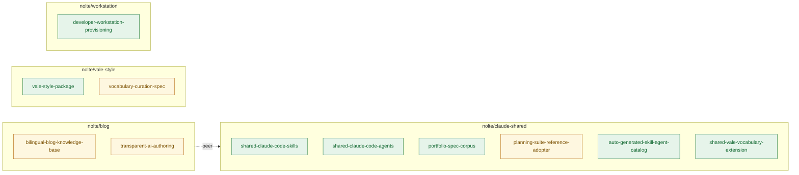

<!-- AUTO-GENERATED by scripts/docs/gen_portfolio.py from portfolio/aggregate.yml. Do not edit by hand; edit the snapshot and run `task docs:portfolio`. -->

# Portfolio inventory

Aggregated capability inventory across the active `nolte/*` portfolio, generated from each member repository's `project/portfolio.yml` manifest. This page is auto-generated — edit `portfolio/aggregate.yml` (or re-run the `portfolio-audit` skill's Render operation), not this file.

**4** repositories · **11** capabilities

## Capability map

Capability-to-repository mapping across the portfolio.

<!-- diagram-source: derived—portfolio/aggregate.yml -->

Status: ✅ active · 🧪 experimental · ⚠️ deprecated · 🗓️ planned

## nolte/blog

> A bilingual AI-drafted and human-curated knowledge base that turns the author's software-project work into durable English and German posts for technical readers, portfolio reviewers, and the author's own future-self.

### Capabilities

| Capability | Status | Description | Audiences |
|---|---|---|---|
| `bilingual-blog-knowledge-base` | 🧪 experimental | A bilingual (English-canonical, German-translated) Astro blog and personal knowledge base, deployed to GitHub Pages, that publishes durable posts as real EN+DE pairs without translation drift for technical readers, portfolio reviewers, and the author's own future-self. | A — Technical readers B — Portfolio reviewers C — Author as knowledge-base user |
| `transparent-ai-authoring` | 🧪 experimental | Per-post AI-disclosure (the aiGenerated frontmatter flag, with a planned visible badge and About-page explanation) that keeps AI-drafted content transparently distinct from hand-curated content. | A — Technical readers B — Portfolio reviewers L — People and projects named in posts |

### Peer references

- `nolte/claude-shared`

## nolte/claude-shared

> claude-shared (the nolte-shared Claude Code plugin) gives downstream Claude Code users in nolte portfolio projects plus the plugin's own dogfooding maintainer a consistent, spec-compliant set of skills, agents, and bilingual specifications they can apply without per-repository reimplementation.

### Capabilities

| Capability | Status | Description | Audiences |
|---|---|---|---|
| `shared-claude-code-skills` | ✅ active | Bundles reusable Claude Code skills (slash commands) under skills/&lt;name&gt;/SKILL.md that downstream nolte portfolio projects install through the plugin marketplace to get consistent, spec-compliant authoring, review, planning, and release workflows. | Downstream Claude Code users in portfolio projects Plugin author dogfooding inside this repo |
| `shared-claude-code-agents` | ✅ active | Bundles reusable Claude Code sub-agents under agents/&lt;name&gt;.md (context-window-protective read-only or write-narrow specialists) that downstream projects invoke through Agent(subagent_type=&lt;plugin&gt;:&lt;agent&gt;). | Downstream Claude Code users in portfolio projects Plugin author dogfooding inside this repo |
| `portfolio-spec-corpus` | ✅ active | Bilingual (EN-canonical with DE translation) specs under spec/ that govern Claude Code skill and agent authoring, project layout, branching, releases, audience identification, and portfolio management for the nolte portfolio. | Plugin author dogfooding inside this repo Other Nolte portfolio repos as passive consumers of the conventions External contributors via pull request |
| `planning-suite-reference-adopter` | 🧪 experimental | Applies the planning-suite specs (mission, goals, roadmap, features, sprints) to claude-shared itself under project/, so other Portfolio-Member repos see the planning suite in action before adopting it. | Plugin author dogfooding inside this repo Downstream Claude Code users in portfolio projects |
| `auto-generated-skill-agent-catalog` | ✅ active | Generates a navigable MkDocs catalog of every skill and agent in the nolte-shared plugin (and optionally external plugin source roots) so downstream readers discover what the plugin ships without reading the source tree directly. | Downstream Claude Code users in portfolio projects Plugin author dogfooding inside this repo External contributors via pull request |
| `shared-vale-vocabulary-extension` | ✅ active | Extends the nolte/vale-style baseline vocabulary with portfolio-specific terms (autoload, autolink, Probot, Renovate, vtracer, retarget, and similar) so prose under README.md, docs/en/, and spec/**/en.md passes Vale across the portfolio. | Plugin author dogfooding inside this repo Other Nolte portfolio repos as passive consumers of the conventions |

### Peer references

_None declared._

## nolte/vale-style

> vale-style ships a single curated Vale style package that consuming nolte/* repositories integrate via one .vale.ini entry to lint markdown consistently across the portfolio.

### Capabilities

| Capability | Status | Description | Audiences |
|---|---|---|---|
| `vale-style-package` | ✅ active | A curated Vale style package distributed as `nolte-styles.zip` via GitHub releases. Consumer repositories integrate it via a single `.vale.ini` `Packages` entry to lint markdown consistently across the portfolio. | nolte/* consumer repositories CI pipelines in consumer repos local developers in consumer repos |
| `vocabulary-curation-spec` | 🧪 experimental | A written specification under `spec/vocabulary-and-style-curation/{en,de}.md` that codifies inclusion criteria, removal policy, and group scoping for the vocabularies shipped in `vale-style-package`. Curator agents from `nolte/claude-shared` (`prose-vale-curator`, `vocab-drift-audit`) cite this spec to ground automated curation decisions. | nolte (primary maintainer) Claude Code agents / skills External contributors |

### Peer references

_None declared._

## nolte/workstation

_No mission statement declared (`project/mission.md` missing)._

### Capabilities

| Capability | Status | Description | Audiences |
|---|---|---|---|
| `developer-workstation-provisioning` | ✅ active | A chezmoi source tree that provisions a developer workstation to an identical, reproducible state from a single `chezmoi init --apply`: asdf-pinned CLI tool versions, a baseline git config, a curated zsh setup, the reusable Taskfile collection, and the pre-commit / cookiecutter / MkDocs Python virtualenvs. | workstation-operator downstream-tooling-consumers |

### Peer references

_None declared._

## Historical capabilities

_No archived repositories with registered capabilities._
