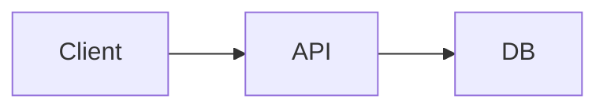

# Example 01 — Wire up MkDocs Mermaid setup in a fresh repo

## Input prompt

> Wire up Mermaid in this repo. The MkDocs setup doesn't render Mermaid blocks yet — make `docs/architecture.md`'s ` ```mermaid ` fence actually render under `task docs`.

## Input files

`mkdocs.yml` (no `pymdownx.superfences`, has `pymdownx.highlight` only):

```yaml
site_name: Example Project
theme:
  name: material
markdown_extensions:
  - admonition
  - pymdownx.highlight:
      anchor_linenums: true
nav:
  - Home: index.md
  - Architecture: architecture.md
```

`docs/requirements.txt` (no `pymdown-extensions`):

```
mkdocs>=1.6
mkdocs-material>=9.5
```

`docs/architecture.md` (a Mermaid block exists but won't render):

````markdown
# Architecture


````

`.git/` is present, working tree is clean on those three files.

## Expected behaviour

1. **Preconditions pass**: confirm the repo is a git tree, locate `mkdocs.yml`, resolve `docs_dir` to `docs/`, confirm clean working tree on `mkdocs.yml`, `docs/`, and `docs/requirements.txt`.
2. **Setup audit (read-only)** reports a grouped table:
   - `mkdocs.yml` extensions: `pymdownx.superfences` with Mermaid `custom_fences` → **missing**
   - `docs/requirements.txt`: `pymdown-extensions` with explicit version specifier → **missing**
   - `theme.name`: `material` → **pass**
   - Forbidden plugins: `mkdocs-mermaid2-plugin` → **pass** (absent)
3. **Setup apply** walks findings one at a time, asking for confirmation before each write:
   - Proposes appending the `pymdownx.superfences` extension entry with the Mermaid `custom_fence` block (preserving `admonition` and `pymdownx.highlight` ordering and keys).
   - Proposes appending `pymdown-extensions>=10` to `docs/requirements.txt` (one entry per line, no `-r` chain).
4. **Refuses** to install or propose `mkdocs-mermaid2-plugin` even if the user asks for it — explains that Material's native superfences bridge is the portfolio standard.
5. **Re-runs only the affected check** after each successful write; both findings flip to **pass**.
6. **Re-audit** (operation 5) prints a fresh grouped summary with all four items at **pass**, plus a one-line note that the Mermaid block in `docs/architecture.md` will render after `task docs` reinstalls dependencies.
7. **Does not** touch `docs/architecture.md` itself (no diagram authoring or audit happened in this scenario), and **does not** add a `mkdocs-mermaid2-plugin` entry, a pre-rendered SVG under `docs/assets/`, or any second `pymdownx.superfences` block.
