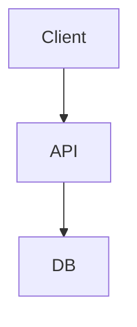
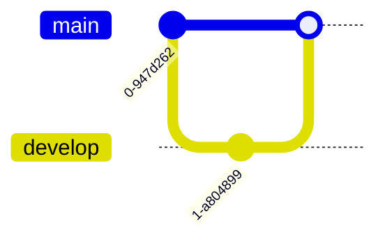
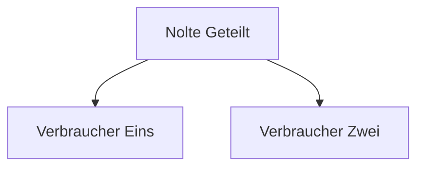
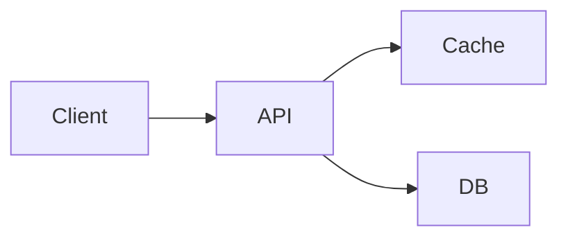

# Example 03 — Audit existing Mermaid blocks against the spec

## Input prompt

> Audit every Mermaid block under `docs/` against the spec and tell me what's broken.

## Input files

`mkdocs.yml` is conforming (`pymdownx.superfences` with the Mermaid `custom_fence`, `theme.name: material`, no Mermaid-only plugins). `docs_dir` is `docs/`. No `mkdocs-static-i18n` configured (single-language repo).

`docs/architecture/overview.md` (block A — missing direction header, missing source marker):

````markdown
# Overview


````

`docs/release/branching.md` (block B — `gitGraph` usage, has source marker):

````markdown
# Branching Model

<!-- diagram-source: derived—spec/project/branching-model/en.md -->

````

`docs/portfolio/consumers.md` (block C — non-English labels, has direction and source marker):

````markdown
# Portfolio-Konsumenten

<!-- diagram-source: user-described—Konsumenten von nolte-shared -->

````

`docs/architecture/components.md` (block D — fully conforming, included to confirm the audit doesn't false-positive):

````markdown
# Components

<!-- diagram-source: user-described—High-level component map of the API service -->

````

## Expected behaviour

1. **Preconditions pass**; setup audit (operation 1) runs first and reports all items **pass** (no setup work needed in this scenario).
2. **Diagram audit (operation 4, read-only)** scans every markdown file under `docs/`, locates the four ` ```mermaid ` fences, and reports findings grouped by category:
   - **Missing source marker**: `docs/architecture/overview.md` (block A).
   - **Missing `flowchart` direction**: `docs/architecture/overview.md` (block A) — first line is `flowchart` with no `LR` / `TB` / `TD`.
   - **`gitGraph` usage**: `docs/release/branching.md` (block B) — non-conformant; the catalog removed `gitGraph`.
   - **Non-English labels**: `docs/portfolio/consumers.md` (block C) — `"Nolte Geteilt"`, `"Verbraucher Eins"`, `"Verbraucher Zwei"` flagged. The German section heading and the `<!-- diagram-source: ... -->` summary are **not** flagged (surrounding prose is allowed in the file's language).
   - **Inline styling**: none found.
   - **Derived-source drift**: skipped for blocks A, C, D (not derived); for block B compares `git log -1 --format=%cs -- spec/project/branching-model/en.md` against `git log -1 --format=%cs -- docs/release/branching.md` and reports drift only if the source is newer.
   - **Block size**: all four under 25 nodes — no SHOULD violation.
   - `docs/architecture/components.md` (block D): no findings.
3. **Per-finding fix proposals**, each gated on explicit user approval:
   - Block A: prepend `<!-- diagram-source: user-described—<ask the user for the one-line summary> -->` and rewrite the first fence line to `flowchart LR` (default for pipeline-shaped flows).
   - Block B: redraft as `flowchart LR` with `subgraph` clusters for `develop` / `main` / release branches and labeled merge / automerge edges; routes back through operation 3 in derived mode against `spec/project/branching-model/`.
   - Block C: re-emit the same structure with English labels (`NolteShared`, `Consumer1`, `Consumer2` or similar) while leaving the German heading and source-marker summary untouched.
4. **No silent writes**: nothing on disk changes during the audit phase; every fix waits for explicit user confirmation.
5. **Refuses** to autofix any finding before approval, **refuses** to emit `gitGraph` in the proposed fix for block B, and **refuses** to translate the in-fence labels of block C into anything other than English.
6. **Re-audit (operation 5)** runs end-to-end after the user has worked through the approvals and prints a fresh grouped summary so the user can see which findings are closed and which (if any) remain open.
